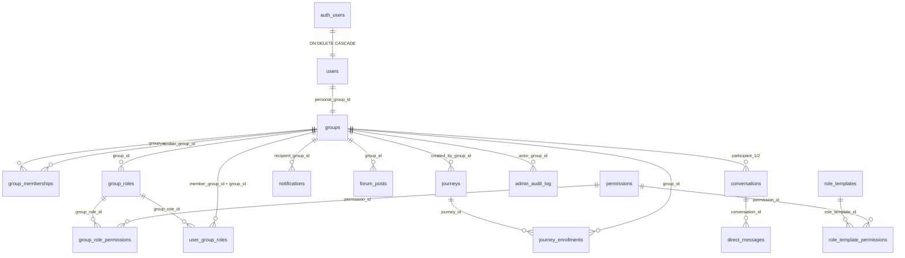
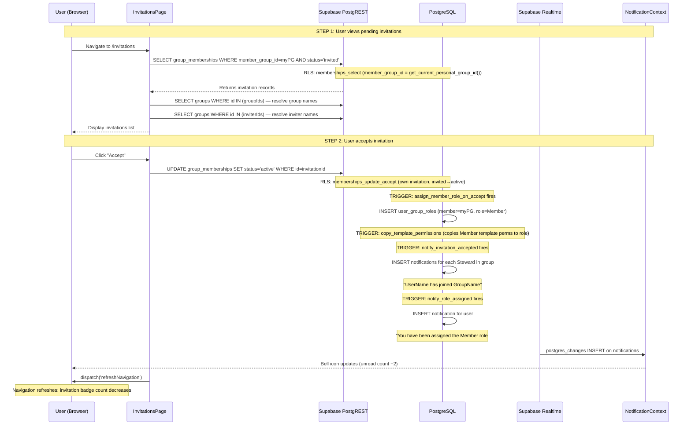
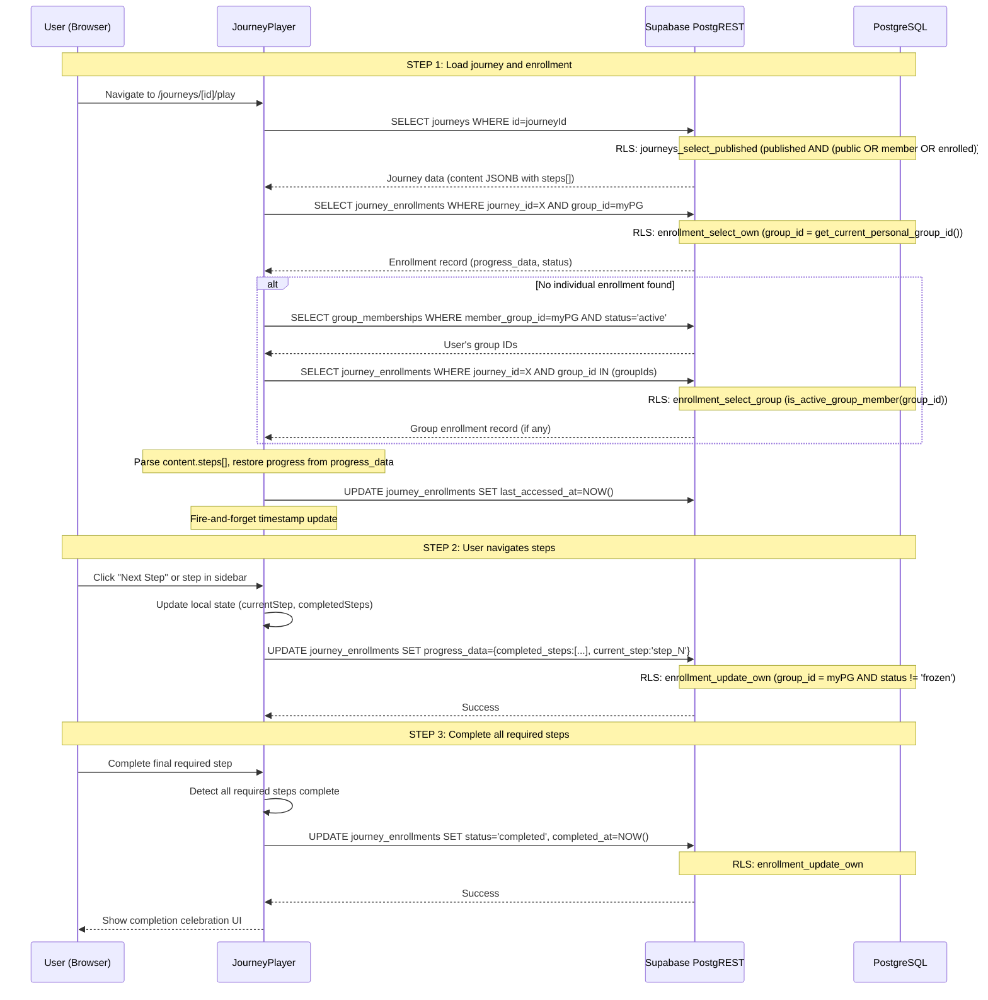
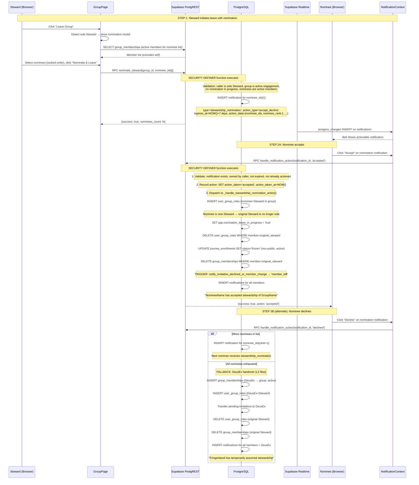
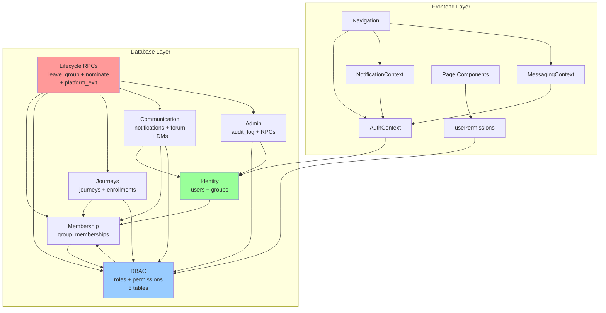

# FringeIsland — Architecture Baseline

**Date of Analysis:** 2026-03-03
**Git Commit:** `5e073f0faa4c138265eb40ed61258e46d96c6606` (main)
**Version:** v0.2.36
**Analyst:** Claude Opus 4.6

**Areas not fully analyzed:** None identified. All source code, migrations, and configuration were accessible.
**Live Database Validation:** 2026-03-03 — All live objects verified against migration files. Zero schema drift found. See §2.10 Schema Drift Report.

---

## 1. Application Layer Anatomy

### 1.1 Directory Structure

```
FringeIsland/
├── app/                          # Next.js App Router (pages + API routes)
│   ├── layout.tsx                # Root layout: AuthProvider → NotificationProvider → MessagingProvider → Navigation
│   ├── page.tsx                  # Landing page
│   ├── error.tsx                 # Route-level error boundary
│   ├── global-error.tsx          # Root layout error boundary
│   ├── not-found.tsx             # Custom 404
│   ├── login/page.tsx            # Login
│   ├── signup/page.tsx           # Signup
│   ├── groups/                   # Group management
│   │   ├── page.tsx              # My Groups list
│   │   ├── create/page.tsx       # Create group form
│   │   └── [id]/                 # Group detail (dynamic route)
│   │       ├── page.tsx          # Group detail + members + forum
│   │       └── edit/page.tsx     # Edit group settings (Steward-only)
│   ├── invitations/page.tsx      # Pending invitations
│   ├── journeys/                 # Journey catalog
│   │   ├── page.tsx              # Browse/search/filter journeys
│   │   └── [id]/                 # Journey detail (dynamic route)
│   │       ├── page.tsx          # Journey overview + curriculum
│   │       └── play/page.tsx     # JourneyPlayer (step-by-step content delivery)
│   ├── my-journeys/page.tsx      # Enrolled journeys (individual + group tabs)
│   ├── messages/                 # Direct messaging
│   │   ├── page.tsx              # Conversation inbox
│   │   └── [conversationId]/page.tsx  # Conversation thread
│   ├── profile/                  # User profile
│   │   ├── page.tsx              # View profile
│   │   └── edit/page.tsx         # Edit profile
│   ├── admin/                    # Platform administration
│   │   ├── layout.tsx            # Admin layout with DeusEx guard
│   │   ├── page.tsx              # Admin dashboard (stats + navigation)
│   │   ├── deusex/page.tsx       # DeusEx member management
│   │   └── fix-orphans/page.tsx  # Orphan group repair tool
│   ├── dev/dashboard/            # Development dashboard
│   │   ├── layout.tsx            # Dev-only layout
│   │   └── page.tsx              # Visual project status (reads PROJECT_STATUS.md + ROADMAP.md)
│   └── api/                      # Next.js API routes (server-side)
│       ├── admin/users/route.ts  # GET /api/admin/users (service_role, paginated, filterable)
│       └── invitations/send-email/route.ts  # POST /api/invitations/send-email (simulated)
├── components/                   # React components (all 'use client')
│   ├── Navigation.tsx            # Global nav bar (links + notification bell + message badge)
│   ├── auth/
│   │   └── AuthForm.tsx          # Login/signup form (shared)
│   ├── ui/
│   │   ├── ConfirmModal.tsx      # Confirmation dialog (danger/warning/info variants)
│   │   └── ErrorBoundary.tsx     # React error boundary wrapper
│   ├── groups/
│   │   ├── GroupCreateForm.tsx   # Group creation form
│   │   ├── InviteMemberModal.tsx # Invite by email (platform users + pending email invitations)
│   │   ├── AssignRoleModal.tsx   # Role assignment modal
│   │   ├── RoleManagementSection.tsx  # Full role CRUD section
│   │   ├── RoleFormModal.tsx     # Create/edit role with permissions
│   │   ├── PermissionPicker.tsx  # Categorized permission checkboxes
│   │   └── forum/
│   │       ├── ForumSection.tsx  # Forum container (post list + composer)
│   │       ├── ForumComposer.tsx # New post/reply input
│   │       ├── ForumPost.tsx     # Single post display
│   │       └── ForumReplyList.tsx # Reply thread
│   ├── journeys/
│   │   ├── EnrollmentModal.tsx   # Enroll individually or as group
│   │   ├── JourneyPlayer.tsx     # Step-by-step journey player
│   │   ├── StepContent.tsx       # Step content renderer
│   │   ├── StepSidebar.tsx       # Step navigation sidebar
│   │   └── ProgressBar.tsx       # Visual progress indicator
│   ├── notifications/
│   │   └── NotificationBell.tsx  # Bell icon + dropdown (passive + actionable notifications)
│   ├── profile/
│   │   ├── AvatarUpload.tsx      # Avatar upload to Supabase Storage
│   │   └── ProfileEditForm.tsx   # Profile edit form
│   ├── admin/
│   │   ├── AdminStatCard.tsx     # Dashboard stat card
│   │   ├── AdminDataPanel.tsx    # User data table with pagination
│   │   ├── DeusexMemberList.tsx  # DeusEx group member list
│   │   ├── UserActionBar.tsx     # Bulk action bar (message, notify, deactivate, etc.)
│   │   ├── GroupPickerModal.tsx  # Group selection for invite/join actions
│   │   ├── MessageModal.tsx      # Send message modal
│   │   └── NotifyModal.tsx       # Send notification modal
│   └── dashboard/
│       ├── DashboardCard.tsx     # Dev dashboard card
│       ├── PhaseTimeline.tsx     # Phase progress timeline
│       ├── FloatingStatsBar.tsx  # Floating stats overlay
│       └── CollapsibleSection.tsx # Collapsible section wrapper
├── lib/                          # Shared libraries, hooks, contexts
│   ├── supabase/
│   │   ├── client.ts             # Browser Supabase client (createBrowserClient from @supabase/ssr)
│   │   ├── server.ts             # Server Supabase client (createServerClient, cookie-based)
│   │   └── middleware.ts         # Session refresh middleware (used by proxy.ts)
│   ├── auth/
│   │   └── AuthContext.tsx       # Auth context + useAuth() hook
│   ├── notifications/
│   │   └── NotificationContext.tsx # Notification context + useNotifications() hook
│   ├── messaging/
│   │   └── MessagingContext.tsx   # Messaging context + useMessaging() hook
│   ├── hooks/
│   │   └── usePermissions.ts     # Permission checking hook (calls get_user_permissions RPC)
│   ├── constants/
│   │   └── permissions.ts        # Permission display order, category labels, sort utility
│   ├── types/
│   │   ├── user.ts               # UserProfile, ProfileData, EditableProfile
│   │   ├── group.ts              # GroupData, Member, RoleData, GroupRoleFull, Permission, Invitation
│   │   ├── journey.ts            # Journey, JourneyContent, JourneyStep, JourneyEnrollment, progress types
│   │   ├── messaging.ts          # Conversation, DirectMessage, ConversationItem
│   │   └── admin.ts              # PlatformStats, DeusexMember, ConfirmModalState
│   ├── admin/
│   │   ├── admin-users-query.ts  # Server-side admin user queries (service_role)
│   │   ├── user-filter.ts        # Client-side user filtering logic
│   │   ├── selection-model.ts    # Multi-select state management
│   │   └── action-bar-logic.ts   # Action bar visibility/disable logic (pure functions)
│   ├── email/
│   │   └── send.ts               # Email abstraction (currently console.log simulation)
│   └── dashboard/
│       ├── parsers.ts            # PROJECT_STATUS.md parser
│       └── roadmap-parser.ts     # ROADMAP.md parser
├── tests/                        # Test suites
│   ├── integration/              # Jest integration tests (550 tests)
│   │   ├── auth/                 # Authentication tests
│   │   ├── groups/               # Group management + lifecycle tests
│   │   ├── journeys/             # Journey catalog + enrollment tests
│   │   ├── rbac/                 # RBAC permission tests
│   │   ├── admin/                # Admin action tests
│   │   ├── rls/                  # RLS policy tests
│   │   ├── communication/        # Notification + messaging tests
│   │   ├── security/             # Security-specific tests
│   │   └── users/                # User management tests
│   ├── unit/                     # Jest unit tests (99 tests)
│   │   ├── admin/                # Admin logic unit tests
│   │   ├── components/           # Component unit tests
│   │   └── lib/                  # Library unit tests
│   ├── e2e/                      # Playwright E2E tests (7 tests)
│   │   ├── auth.spec.ts          # Auth flow tests
│   │   ├── journeys.spec.ts      # Journey browsing tests
│   │   ├── global-setup.ts       # Browser login setup
│   │   ├── global-teardown.ts    # Test data cleanup
│   │   └── helpers/auth.ts       # E2E auth helpers
│   └── helpers/                  # Shared test utilities
├── scripts/                      # Build/deploy/maintenance scripts
│   ├── apply-migration-temp.js   # Apply migration via REST API
│   ├── cleanup-test-data.js      # Clean test data from database
│   ├── get-db-config.js          # Extract DB config from env
│   ├── run-sql.js                # Run arbitrary SQL against database
│   └── verify-schema.js          # Verify schema state
├── supabase/
│   └── migrations/               # 16 active + 71 archived SQL migrations
├── proxy.ts                      # Next.js 16 request proxy (replaces middleware.ts)
├── next.config.ts                # Next.js config (image remote patterns for Supabase Storage)
├── jest.config.js                # Jest configuration
├── playwright.config.ts          # Playwright configuration
├── tsconfig.json                 # TypeScript config (strict, path alias @/*)
├── eslint.config.mjs             # ESLint configuration
└── postcss.config.mjs            # PostCSS + Tailwind configuration
```

### 1.2 Routing Map

**25 routes** organized by feature domain:

| Route | Type | Auth Required | Description |
|-------|------|--------------|-------------|
| `/` | Static | No | Landing page |
| `/login` | Static | No | Login form |
| `/signup` | Static | No | Signup form |
| `/groups` | Static | Yes | My Groups list |
| `/groups/create` | Static | Yes | Create group form |
| `/groups/[id]` | Dynamic | Yes | Group detail (members, forum, roles) |
| `/groups/[id]/edit` | Dynamic | Yes | Edit group settings (Steward-only) |
| `/invitations` | Static | Yes | Pending invitations |
| `/journeys` | Static | Yes | Journey catalog (search, filter) |
| `/journeys/[id]` | Dynamic | Yes | Journey detail (overview + curriculum) |
| `/journeys/[id]/play` | Dynamic | Yes | JourneyPlayer (step-by-step) |
| `/my-journeys` | Static | Yes | Enrolled journeys |
| `/messages` | Static | Yes | Message inbox |
| `/messages/[conversationId]` | Dynamic | Yes | Conversation thread |
| `/profile` | Static | Yes | View own profile |
| `/profile/edit` | Static | Yes | Edit profile |
| `/admin` | Static | Yes + DeusEx | Admin dashboard |
| `/admin/deusex` | Static | Yes + DeusEx | DeusEx member management |
| `/admin/fix-orphans` | Static | Yes + DeusEx | Orphan group repair |
| `/dev/dashboard` | Static | No | Development status dashboard |
| `GET /api/admin/users` | API | Yes + DeusEx | Admin user list (service_role) |
| `POST /api/invitations/send-email` | API | Yes + Permission | Send invitation email |

**Route protection:** `proxy.ts` refreshes Supabase sessions on every request. Individual pages check auth via `useAuth()` and redirect to `/login` if not authenticated. Admin pages additionally check DeusEx membership.

### 1.3 Component Hierarchy

```
RootLayout (app/layout.tsx)
├── ErrorBoundary
│   └── AuthProvider (lib/auth/AuthContext.tsx)
│       └── NotificationProvider (lib/notifications/NotificationContext.tsx)
│           └── MessagingProvider (lib/messaging/MessagingContext.tsx)
│               ├── Navigation (components/Navigation.tsx)
│               │   ├── NotificationBell
│               │   └── [message badge from useMessaging()]
│               └── {children} — page content
```

**Provider nesting order matters:**
1. `ErrorBoundary` — catches React render errors at the top level
2. `AuthProvider` — manages Supabase auth state, user profile, force-logout
3. `NotificationProvider` — depends on AuthProvider (needs `userProfile.personal_group_id`)
4. `MessagingProvider` — depends on AuthProvider (needs `userProfile.personal_group_id`)

### 1.4 State Management Patterns

**Three React Contexts** provide global state:

| Context | Hook | State | Realtime | Purpose |
|---------|------|-------|----------|---------|
| `AuthContext` | `useAuth()` | user, session, userProfile, loading | Yes (force-logout broadcast channel) | Authentication, profile resolution, session validation |
| `NotificationContext` | `useNotifications()` | notifications[], unreadCount | Yes (postgres_changes on notifications table) | Notification CRUD, smart notification actions |
| `MessagingContext` | `useMessaging()` | unreadConversationCount | Yes (postgres_changes on direct_messages table) | Unread message count tracking |

**One custom hook** for authorization:

| Hook | Purpose | Backend Call |
|------|---------|-------------|
| `usePermissions(groupId)` | Returns `hasPermission(name)` for current user in a group context | `get_user_permissions` RPC |

**Cross-component communication:**
- `window.dispatchEvent(new CustomEvent('refreshNavigation'))` — triggers AuthContext profile refresh, NotificationContext unread recount, and MessagingContext unread recount. Used after data mutations (accept invitation, edit profile, etc.).

**Local state pattern:** All page-level data fetching uses component-local `useState` + `useEffect` with direct Supabase client calls. No global data store (Redux, Zustand, etc.).

### 1.5 Key Shared Modules

| Module | Path | Purpose |
|--------|------|---------|
| Supabase Browser Client | `lib/supabase/client.ts` | `createBrowserClient()` — for client components |
| Supabase Server Client | `lib/supabase/server.ts` | `createServerClient()` — for RSC, reads cookies |
| Session Middleware | `lib/supabase/middleware.ts` | Refreshes auth session on each request |
| Permission Constants | `lib/constants/permissions.ts` | 31 permissions with categories, display order, sort utility |
| Type Definitions | `lib/types/*.ts` | 5 type files: user, group, journey, messaging, admin |
| Admin Query Logic | `lib/admin/admin-users-query.ts` | Server-side user queries using service_role |
| Admin UI Logic | `lib/admin/action-bar-logic.ts` | Pure functions for action bar state (B-ADMIN-014) |
| Email Service | `lib/email/send.ts` | Abstraction layer (currently simulated via console.log) |
| Dashboard Parsers | `lib/dashboard/parsers.ts` | Parse PROJECT_STATUS.md for dev dashboard |

### 1.6 Configuration Files

| File | Purpose | Key Settings |
|------|---------|-------------|
| `next.config.ts` | Next.js config | Remote image patterns for Supabase Storage avatars |
| `proxy.ts` | Request proxy | Session refresh on all non-static routes (Next.js 16 replaces middleware.ts) |
| `tsconfig.json` | TypeScript | Strict mode, `@/*` path alias, ES2017 target, bundler resolution |
| `jest.config.js` | Jest testing | Integration + unit test configuration |
| `playwright.config.ts` | E2E testing | Chromium, base URL localhost:3000 |
| `eslint.config.mjs` | Linting | ESLint flat config |
| `postcss.config.mjs` | CSS processing | Tailwind CSS plugin |

---

## 2. Database Layer Anatomy

### 2.1 Schema Overview

**19 tables** organized into 5 domains, plus 1 additional table for email invitations:



### 2.2 Table Inventory

#### Core Identity (2 tables)

| Table | Columns | Purpose |
|-------|---------|---------|
| `users` | id, auth_user_id, email, full_name, nickname, display_preference, show_real_name, avatar_url, bio, is_active, is_decommissioned, personal_group_id, created_at, updated_at | Auth bridge — links Supabase auth to application identity |
| `groups` | id, name, description, label, avatar_url, created_by_group_id, created_from_group_template_id, group_type, status, is_public, show_member_list, settings, created_at, updated_at | Universal identity container — personal, system, or engagement |

**Key design: D15 Universal Group Pattern.** Every user has a personal group that IS their identity in the group system. `users.personal_group_id` → `groups.id` creates a 1:1 bridge. All foreign keys reference groups, never users directly. `get_current_personal_group_id()` is THE primary identity function.

**Group types** (CHECK constraint): `personal` (user identity), `system` (DeusEx, FI Members, [Deleted User]), `engagement` (user-created groups).

**Group status** (CHECK constraint): `active`, `closed`, `archived`, `suspended`. Non-admin users can only see active groups (except personal groups, which are always visible).

#### Authorization (6 tables)

| Table | Columns | Purpose |
|-------|---------|---------|
| `permissions` | id, name, description, category, created_at | Catalog of 31 permissions |
| `role_templates` | id, name, description, is_system, created_at | 4 templates: Steward, Guide, Member, Observer |
| `role_template_permissions` | id, role_template_id, permission_id, granted | Template → permission mapping |
| `group_templates` | id, name, description, is_system, created_at | Group creation templates |
| `group_template_roles` | id, group_template_id, role_template_id, is_default | Template → role mapping |
| `group_roles` | id, group_id, name, description, created_from_role_template_id, created_at | Group-scoped role instances (UNIQUE group_id + name) |
| `group_role_permissions` | id, group_role_id, permission_id, granted, created_at | Instance-level permission overrides |
| `user_group_roles` | id, member_group_id, group_id, group_role_id, assigned_by_group_id, assigned_at | Role assignments (group-to-group, UNIQUE member + group + role) |

**Authorization model:** Two-tier permission resolution via `has_permission()`:
1. **Tier 1 (System):** Check permissions in system groups (context-free, e.g., DeusEx `manage_all_groups`)
2. **Tier 2 (Context):** Check permissions in the specified engagement group

**Anti-escalation:** `can_assign_role()` prevents granting permissions the assigner doesn't hold.

#### Group Membership (2 tables)

| Table | Columns | Purpose |
|-------|---------|---------|
| `group_memberships` | id, group_id, member_group_id, added_by_group_id, status, added_at, status_changed_at | Group-to-group membership (UNIQUE group + member) |
| `pending_email_invitations` | id, group_id, invited_email, invited_by_group_id, token, status, created_at, expires_at, claimed_at | Pre-signup invitations (30-day expiry, auto-claimed on signup) |

**Membership status** (CHECK): `active`, `invited`, `paused`, `removed`.
**Email invitation status** (CHECK): `pending`, `claimed`, `expired`.

#### Journey System (2 tables)

| Table | Columns | Purpose |
|-------|---------|---------|
| `journeys` | id, title, description, created_by_group_id, is_published, is_public, journey_type, content (JSONB), estimated_duration_minutes, difficulty_level, tags (TEXT[]), created_at, updated_at, published_at | Learning journey definitions |
| `journey_enrollments` | id, journey_id, group_id, enrolled_by_group_id, status, progress_data (JSONB), enrolled_at, status_changed_at, completed_at, last_accessed_at | Enrollment tracking |

**Journey type** (CHECK): `predefined`, `user_created`, `dynamic`.
**Enrollment status** (CHECK): `active`, `completed`, `paused`, `frozen`. Frozen enrollments are locked by the system (e.g., when leaving a group with non-public journeys).

#### Communication (4 tables)

| Table | Columns | Purpose |
|-------|---------|---------|
| `notifications` | id, recipient_group_id, type, title, body, payload (JSONB), group_id, is_read, read_at, action_type, action_data (JSONB), action_taken, action_taken_at, expires_at, created_at | Push notifications (passive + actionable) |
| `forum_posts` | id, group_id, author_group_id, parent_post_id (self-ref), content, is_deleted, created_at, updated_at | Flat-threaded group forum (max 2 levels) |
| `conversations` | id, participant_1, participant_2, last_message_at, participant_1_last_read_at, participant_2_last_read_at, created_at | 1:1 DM conversations (CHECK: p1 < p2, p1 != p2) |
| `direct_messages` | id, conversation_id, sender_group_id, content, created_at | Individual messages |

**Actionable notifications** (Sprint 3): `action_type` = `accept_decline` or `acknowledge`. `action_data` stores context (e.g., nominee list for stewardship). `expires_at` enables time-bounded actions (7-day stewardship nominations).

#### Admin (1 table)

| Table | Columns | Purpose |
|-------|---------|---------|
| `admin_audit_log` | id, actor_group_id, action, target, metadata (JSONB), created_at | Audit trail for admin operations |

### 2.3 RPC Function Catalog

**27 non-trigger functions** organized by domain (plus 24 trigger-backing functions documented in §2.4):

#### Identity & Helper Functions (11)

| Function | Returns | Security | Purpose |
|----------|---------|----------|---------|
| `get_current_user_profile_id()` | UUID | DEFINER | Returns `users.id` for current auth session |
| `get_current_personal_group_id()` | UUID | DEFINER | **THE primary identity function** — returns personal group ID |
| `is_active_group_member(group_id)` | BOOLEAN | DEFINER | Quick membership check for RLS |
| `is_invited_group_member(group_id)` | BOOLEAN | DEFINER | Invitation check for group visibility |
| `is_group_creator(group_id)` | BOOLEAN | DEFINER | Bootstrap check for new groups |
| `group_has_leader(group_id)` | BOOLEAN | DEFINER | Detects leaderless groups (bootstrap detection) |
| `is_platform_admin()` | BOOLEAN | DEFINER | PG17-safe admin check (used in RLS policies) |
| `get_group_id_for_role(role_id)` | UUID | DEFINER | RLS bypass helper for group_role_permissions |
| `get_permission_name(perm_id)` | TEXT | DEFINER | RLS bypass helper for anti-escalation checks |
| `is_conversation_participant(conv_id)` | BOOLEAN | DEFINER | DM participant check for RLS |
| `get_group_member_counts(group_ids[])` | TABLE(group_id, member_count) | DEFINER | Batch active member count for group listings |

#### RBAC Functions (3)

| Function | Returns | Security | Purpose |
|----------|---------|----------|---------|
| `has_permission(acting_group, context_group, perm_name)` | BOOLEAN | DEFINER | **THE core RBAC check** — two-tier (system + context) |
| `get_user_permissions(acting_group, context_group)` | TEXT[] | DEFINER | Returns all permissions for a group in a context |
| `can_assign_role(acting_group, group, role_id)` | BOOLEAN | DEFINER | Anti-escalation check for role assignment |

#### Lifecycle RPCs (4)

| Function | Returns | Security | Purpose |
|----------|---------|----------|---------|
| `leave_group(group_id)` | JSONB | DEFINER | L1 regular leave, L2 DeusEx handover, L3 group closure |
| `nominate_steward(group_id, nominee_ids[])` | JSONB | DEFINER | Track 1: Steward nomination with ranked fallback |
| `handle_notification_action(notif_id, action)` | JSONB | DEFINER | Generic actionable notification handler (dispatches to type-specific handlers) |
| `_handle_stewardship_nomination_action(...)` | VOID | DEFINER | Internal: processes accept/decline on stewardship nominations |

#### Admin RPCs (6)

| Function | Returns | Security | Purpose |
|----------|---------|----------|---------|
| `admin_hard_delete_user(user_id)` | JSONB | DEFINER | Permanent deletion (reassigns content to [Deleted User] sentinel) |
| `admin_update_user_status(user_id, is_active)` | JSONB | DEFINER | Activate/deactivate user (respects decommission invariant) |
| `admin_decommission_user(user_id)` | JSONB | DEFINER | Soft decommission (is_decommissioned + is_active=false) |
| `admin_send_notification(user_ids[], title, message)` | JSONB | DEFINER | Send admin notification to multiple users |
| `admin_exit_user_from_platform(user_id)` | JSONB | DEFINER | **Cascade exit** from all groups + decommission + force logout |
| `admin_force_logout(target_user_ids[])` | JSONB | DEFINER | Invalidate auth sessions + refresh tokens for target users |

#### Conversation Helper (1)

| Function | Returns | Security | Purpose |
|----------|---------|----------|---------|
| `can_update_conversation(conv_id, p1_read, p2_read)` | BOOLEAN | DEFINER | Column-level restriction: only update your own last_read_at |

#### Security Helpers (2)

| Function | Returns | Security | Purpose |
|----------|---------|----------|---------|
| `is_enrolled_in_journey(journey_id)` | BOOLEAN | DEFINER | Enrollment check for journey visibility (RLS bypass) |
| `is_journey_enrollable(journey_id)` | BOOLEAN | DEFINER | Pre-enrollment validation (published + public/member) |

**Note:** `_handle_stewardship_nomination_action` (listed above in Lifecycle) is an internal helper called by `handle_notification_action()`, not intended for direct frontend use. Trigger-backing functions (e.g., `update_updated_at_column`, `copy_template_permissions_on_role_create`) are documented separately in §2.4.

### 2.4 Trigger Inventory

**27 triggers** across 10 tables (2 in `auth` schema, 25 in `public` schema):

#### On `auth.users` (2 triggers)

| Trigger | Timing | Function | Purpose |
|---------|--------|----------|---------|
| `on_auth_user_created` | AFTER INSERT | `handle_new_user()` | Creates user profile + personal group + self-membership + "Myself" role + FI Members enrollment + claims pending email invitations (8-step bootstrap) |
| `on_auth_user_deleted` | AFTER DELETE | `handle_user_deletion()` | Soft-deletes user (is_active=false) |

#### On `users` (3 triggers)

| Trigger | Timing | Function | Purpose |
|---------|--------|----------|---------|
| `set_users_updated_at` | BEFORE UPDATE | `update_updated_at_column()` | Auto-timestamp |
| `enforce_decommission_invariant` | BEFORE UPDATE | `enforce_decommission_invariant()` | Decommissioned → always inactive |
| `enforce_personal_group_id_immutability` | BEFORE UPDATE | `enforce_personal_group_id_immutability()` | personal_group_id cannot change once set (session-variable bypass for admin hard-delete) |

#### On `groups` (2 triggers)

| Trigger | Timing | Function | Purpose |
|---------|--------|----------|---------|
| `set_groups_updated_at` | BEFORE UPDATE | `update_updated_at_column()` | Auto-timestamp |
| `notify_group_deleted` | BEFORE DELETE | `notify_group_deleted()` | Notify members before group CASCADE (skip during hard-delete) |

#### On `group_memberships` (7 triggers)

| Trigger | Timing | Function | Purpose |
|---------|--------|----------|---------|
| `check_last_deusex_membership_removal` | BEFORE DELETE | `prevent_last_deusex_membership_removal()` | Prevent removing last DeusEx member |
| `notify_invitation_received` | AFTER INSERT | `notify_invitation_received()` | Notify invitee when invited |
| `assign_member_role_on_accept` | AFTER UPDATE (invited→active) | `auto_assign_member_role_on_accept()` | Auto-assign Member role on accept |
| `auto_assign_deusex_role` | AFTER UPDATE | `auto_assign_deusex_role_on_accept()` | Auto-assign DeusEx role on DeusEx accept |
| `notify_invitation_accepted` | AFTER UPDATE | `notify_invitation_accepted()` | Notify Stewards when invitation accepted |
| `notify_invitation_declined_or_member_change` | AFTER DELETE | `notify_invitation_declined_or_member_change()` | Notify on decline/leave/remove (skip during hard-delete) |
| `trg_audit_admin_membership_change` | AFTER INSERT/DELETE | `audit_admin_membership_change()` | Audit admin membership operations |

#### On `user_group_roles` (5 triggers)

| Trigger | Timing | Function | Purpose |
|---------|--------|----------|---------|
| `validate_user_group_role` | BEFORE INSERT | `validate_user_group_role()` | Ensure role belongs to correct group |
| `check_last_leader_removal` | BEFORE DELETE | `prevent_last_leader_removal()` | Prevent removing last Steward (bypassed for closed groups + hard-delete) |
| `check_last_deusex_role_removal` | BEFORE DELETE | `prevent_last_deusex_role_removal()` | Prevent removing last DeusEx role holder |
| `notify_role_assigned` | AFTER INSERT | `notify_role_assigned()` | Notify member of role assignment |
| `notify_role_removed` | AFTER DELETE | `notify_role_removed()` | Notify member of role removal (skip during hard-delete) |

#### On `group_roles` (1 trigger)

| Trigger | Timing | Function | Purpose |
|---------|--------|----------|---------|
| `copy_template_permissions` | AFTER INSERT | `copy_template_permissions_on_role_create()` | Auto-copy template permissions + auto-link by name convention |

#### On `permissions` (1 trigger)

| Trigger | Timing | Function | Purpose |
|---------|--------|----------|---------|
| `auto_grant_to_deusex` | AFTER INSERT | `auto_grant_permission_to_deusex()` | New permissions auto-granted to DeusEx |

#### On `journeys` (1 trigger)

| Trigger | Timing | Function | Purpose |
|---------|--------|----------|---------|
| `set_journeys_updated_at` | BEFORE UPDATE | `update_updated_at_column()` | Auto-timestamp |

#### On `forum_posts` (2 triggers)

| Trigger | Timing | Function | Purpose |
|---------|--------|----------|---------|
| `enforce_flat_threading` | BEFORE INSERT | `enforce_flat_threading()` | Max 2-level threading (no reply-to-reply) |
| `set_forum_posts_updated_at` | BEFORE UPDATE | `update_updated_at_column()` | Auto-timestamp |

#### On `direct_messages` (2 triggers)

| Trigger | Timing | Function | Purpose |
|---------|--------|----------|---------|
| `update_conversation_last_message` | AFTER INSERT | `update_conversation_last_message_at()` | Update conversation timestamp |
| `trg_audit_admin_message_send` | AFTER INSERT | `audit_admin_message_send()` | Audit admin message sends |

#### On `users` (1 additional trigger — from display name migration)

| Trigger | Timing | Function | Purpose |
|---------|--------|----------|---------|
| `sync_display_name_to_personal_group` | AFTER UPDATE OF nickname/full_name/display_preference | `sync_personal_group_display_name()` | Keep personal group name in sync with display preference |

**Session variable bypass pattern:** Three session variables control trigger behavior during admin operations:
- `app.hard_delete_in_progress` — skips notification triggers + leader protection during CASCADE deletes
- `app.bypass_personal_group_id_immutability` — allows personal_group_id nullification during hard-delete
- `app.nomination_leave_in_progress` — allows role deletion during stewardship nomination acceptance

### 2.5 RLS Policy Map

**All 19 tables have RLS enabled.** 55 policies across all tables (confirmed by live validation).

#### Catalog Tables (read-only)

| Table | Policy | Operation | Rule |
|-------|--------|-----------|------|
| `permissions` | `auth_read_permissions` | SELECT | `true` (all authenticated) |
| `role_templates` | `auth_read_role_templates` | SELECT | `true` |
| `group_templates` | `auth_read_group_templates` | SELECT | `true` |
| `role_template_permissions` | `auth_read_role_template_permissions` | SELECT | `true` |
| `group_template_roles` | `auth_read_group_template_roles` | SELECT | `true` |

#### Users

| Policy | Operation | Rule |
|--------|-----------|------|
| `users_select_active` | SELECT | `is_active = true` (inactive users invisible to everyone) |
| `users_update_own` | UPDATE | `auth_user_id = auth.uid()` |
| (replaced by is_platform_admin) | UPDATE | Admin override via SECURITY DEFINER RPCs |

#### Groups

| Policy | Operation | Rule |
|--------|-----------|------|
| `groups_select` | SELECT | `personal` type OR (`active` status AND (public OR member OR invited OR creator)) OR `is_platform_admin()` |
| `groups_insert` | INSERT | `created_by_group_id = get_current_personal_group_id()` |
| `groups_update` | UPDATE | `has_permission('edit_group_settings')` |
| `groups_delete` | DELETE | `has_permission('delete_group')` |

#### Group Memberships

| Policy | Operation | Rule |
|--------|-----------|------|
| `memberships_select` | SELECT | Active member of group OR own membership OR `is_platform_admin()` |
| `memberships_insert_invite` | INSERT | Status='invited' + `has_permission('invite_members')` |
| `memberships_insert_bootstrap` | INSERT | Self-add during group creation (creator + no leader yet) |
| `memberships_update_accept` | UPDATE | Own invitation (invited→active), WITH CHECK (status='active') |
| `memberships_delete_leave` | DELETE | Own membership |
| `memberships_delete_remove` | DELETE | `has_permission('remove_members')` |
| `gm_delete_admin` | DELETE | `is_platform_admin()` |
| `gm_insert_admin` | INSERT | `is_platform_admin()` |

#### User Group Roles

| Policy | Operation | Rule |
|--------|-----------|------|
| `ugr_select` | SELECT | Active member OR own roles OR `is_platform_admin()` |
| `ugr_insert_assign` | INSERT | `can_assign_role()` (includes anti-escalation) OR bootstrap (no leader yet) |
| `ugr_delete` | DELETE | `has_permission('assign_roles')` |
| `ugr_insert_admin` | INSERT | `is_platform_admin()` |
| `ugr_delete_admin` | DELETE | `is_platform_admin()` |

#### Group Roles

| Policy | Operation | Rule |
|--------|-----------|------|
| `group_roles_select` | SELECT | Active member OR invited OR `is_platform_admin()` |
| `group_roles_insert` | INSERT | `has_permission('manage_roles')` OR bootstrap (creator + no leader) |
| `group_roles_update` | UPDATE | `has_permission('manage_roles')` |
| `group_roles_delete` | DELETE | Custom roles only (`created_from_role_template_id IS NULL`) + `has_permission('manage_roles')` |

#### Group Role Permissions

| Policy | Operation | Rule |
|--------|-----------|------|
| `grp_select` | SELECT | Active member or creator of role's group |
| `grp_insert` | INSERT | `has_permission('manage_roles')` + anti-escalation (must hold the permission being granted) |
| `grp_delete` | DELETE | `has_permission('manage_roles')` |

#### Journeys

| Policy | Operation | Rule |
|--------|-----------|------|
| `journeys_select_published` | SELECT | Published AND (public OR owning group member OR enrolled OR admin) |

#### Journey Enrollments

| Policy | Operation | Rule |
|--------|-----------|------|
| `enrollment_select_own` | SELECT | Own personal group enrollments |
| `enrollment_select_group` | SELECT | Active member of enrolled group |
| `enrollment_insert_individual` | INSERT | Own personal group + `is_journey_enrollable()` |
| `enrollment_insert_group` | INSERT | `has_permission('enroll_group_in_journey')` + `is_journey_enrollable()` |
| `enrollment_update_own` | UPDATE | Own enrollment + `status != 'frozen'` |
| `enrollment_update_group` | UPDATE | `has_permission('enroll_group_in_journey')` + `status != 'frozen'` |

#### Notifications, Forum, DMs

| Table | Pattern | Rule |
|-------|---------|------|
| `notifications` | SELECT/UPDATE/DELETE own | `recipient_group_id = get_current_personal_group_id()` |
| `forum_posts` | SELECT | `has_permission('view_forum')` |
| `forum_posts` | INSERT | Author check + `has_permission('post_forum_messages'/'reply_to_messages')` |
| `forum_posts` | UPDATE own | Author check + not deleted |
| `forum_posts` | UPDATE moderate | `has_permission('moderate_forum')` |
| `conversations` | SELECT/INSERT/UPDATE | Participant check (`participant_1` or `participant_2`) |
| `direct_messages` | SELECT | `is_conversation_participant()` |
| `direct_messages` | INSERT | Sender check + participant check |

#### Admin Audit Log

| Policy | Operation | Rule |
|--------|-----------|------|
| `audit_log_select_admin` | SELECT | `is_platform_admin()` |
| `audit_log_insert_admin` | INSERT | `is_platform_admin()` |

#### Pending Email Invitations

| Policy | Operation | Rule |
|--------|-----------|------|
| `pending_invitations_select` | SELECT | `has_permission('invite_members')` |
| `pending_invitations_insert` | INSERT | `has_permission('invite_members')` + self-as-inviter |
| `pending_invitations_delete` | DELETE | `has_permission('invite_members')` |

### 2.6 Indexing Strategy

**32 explicit indexes** (plus 19 PK indexes and 13 UNIQUE constraint indexes) optimized for the permission system's JOIN chains and common query paths:

| Index | Table | Columns/Condition | Purpose |
|-------|-------|-------------------|---------|
| `idx_users_auth_user_id` | users | auth_user_id | Auth session lookup |
| `idx_users_personal_group_id` | users | personal_group_id | Identity resolution |
| `idx_users_email` | users | email | Email search (invitations) |
| `idx_groups_group_type` | groups | group_type | Type filtering |
| `idx_groups_created_by` | groups | created_by_group_id | Creator lookup |
| `idx_groups_is_public` | groups | is_public WHERE true | Public group filtering (partial) |
| `idx_groups_status_active` | groups | id WHERE status='active' | Active group filtering (partial) |
| `idx_memberships_member_group_status` | group_memberships | member_group_id, group_id, status | **Critical:** has_permission() hot path |
| `idx_memberships_group_status` | group_memberships | group_id, status | Member listing |
| `idx_ugr_member_group_role` | user_group_roles | member_group_id, group_id, group_role_id | **Critical:** has_permission() JOIN chain |
| `idx_group_roles_group` | group_roles | group_id | Role lookup by group |
| `idx_grp_role` | group_role_permissions | group_role_id | Permission lookup by role |
| `idx_journeys_published` | journeys | is_published, is_public | Catalog browsing |
| `idx_enrollments_group` | journey_enrollments | group_id | Group enrollment lookup |
| `idx_enrollments_journey` | journey_enrollments | journey_id | Journey enrollment lookup |
| `idx_notifications_recipient_unread` | notifications | recipient, created_at DESC WHERE !read | Unread count (partial) |
| `idx_notifications_recipient` | notifications | recipient, created_at DESC | All notifications |
| `idx_notifications_group` | notifications | group_id WHERE NOT NULL | Group-scoped notifications (partial) |
| `idx_notifications_pending_actions` | notifications | recipient, type, created_at WHERE actionable+pending | Actionable notification lookup (partial) |
| `idx_forum_posts_group_created` | forum_posts | group_id, created_at DESC | Forum listing |
| `idx_forum_posts_parent` | forum_posts | parent_post_id WHERE NOT NULL | Reply lookup (partial) |
| `idx_forum_posts_author` | forum_posts | author_group_id | Author lookup |
| `idx_forum_posts_group_toplevel` | forum_posts | group_id, created_at WHERE top-level+active | Top-level post listing (partial) |
| `idx_conversations_p1/p2` | conversations | participant_1/2, last_message_at DESC | Inbox listing |
| `idx_dm_conversation_asc/desc` | direct_messages | conversation_id, created_at ASC/DESC | Message thread (both directions) |
| `idx_pending_invitations_email_status` | pending_email_invitations | email WHERE pending | Signup trigger lookup (partial) |
| `idx_pending_invitations_group_status` | pending_email_invitations | group_id, status | Group invitation listing |
| `idx_audit_log_actor/action/created` | admin_audit_log | Various | Admin panel queries |

**Design notes:** Heavy use of partial indexes (WHERE clauses) to keep index size small. The `has_permission()` function's JOIN chain (group_memberships → user_group_roles → group_role_permissions → permissions) has covering composite indexes on the first two tables for performance.

### 2.7 Data Patterns

#### Soft Delete / Decommission

Two-level user removal:
1. **Soft delete (deactivate):** `is_active = false` — user invisible but data preserved. Reversible.
2. **Decommission:** `is_decommissioned = true` + `is_active = false` — permanent soft-delete. NOT reversible (invariant enforced by trigger). Used by platform exit flow.
3. **Hard delete:** Physical removal via `admin_hard_delete_user()` — reassigns content to `[Deleted User]` sentinel group, then CASCADE deletes personal group. Irreversible.

**Forum posts** use `is_deleted = true` soft delete (content hidden but record preserved for threading).

#### Temporal Patterns

- **Enrollment freezing:** Non-public journey enrollments are frozen (`status = 'frozen'`) with `progress_data.frozen_reason` and `progress_data.frozen_at` when a member leaves a group or a group closes.
- **Notification expiry:** Actionable notifications (e.g., stewardship nominations) have `expires_at` set to 7 days. The `handle_notification_action()` RPC checks expiry before processing.
- **Email invitation expiry:** `pending_email_invitations.expires_at` defaults to 30 days from creation.

#### Seed Data

The schema includes seed data inserted via migrations:
- **3 system groups:** DeusEx (admin), FringeIsland Members (all users), [Deleted User] (sentinel)
- **1 engagement group:** FringeIsland Journeys (owns predefined journeys, Steward = DeusEx)
- **4 role templates:** Steward, Guide, Member, Observer (with template permissions)
- **31 permissions** across 7 categories
- **8 predefined journeys** (leadership, communication, teams, personal dev, strategy, EQ, agile, resilience)

### 2.8 Realtime Publication

3 tables are published via `supabase_realtime` for Supabase Realtime subscriptions:

| Table | Subscriber | Purpose |
|-------|-----------|---------|
| `notifications` | NotificationContext | Push new notifications to bell icon |
| `direct_messages` | MessagingContext | Update unread message count |
| `conversations` | MessagingContext | Track conversation state changes |

### 2.9 pg_cron Jobs / Views / Materialized Views

**None.** No pg_cron jobs, views, or materialized views exist. The `cron` extension is not enabled on this Supabase project (confirmed by live validation: `cron.job` relation does not exist). The stewardship nomination timeout is handled via `expires_at` column on notifications, checked at action time rather than via scheduled job. Enabling pg_cron would require a Supabase project upgrade or extension activation.

### 2.10 Schema Drift Report

**Validation Date:** 2026-03-03
**Method:** Live database queried via Supabase Management API (`information_schema.routines`, `information_schema.triggers`, `pg_policies`, `pg_indexes`, `pg_class`) and compared against migration files in `supabase/migrations/`.

#### Result: Zero Schema Drift

Every object in the live database is backed by a migration file. Every migration has been applied. There are **no LIVE-ONLY items** (created directly in Supabase dashboard) and **no REPO-ONLY items** (migrations not applied).

#### Live vs Migration Verification

| Object Type | Live Count | Migration-Backed | LIVE-ONLY | REPO-ONLY |
|-------------|-----------|-------------------|-----------|-----------|
| Tables | 19 | 19 | 0 | 0 |
| Functions (public) | 51 (27 RPC + 24 trigger) | 51 | 0 | 0 |
| Triggers (public) | 25 unique (26 rows) | 25 | 0 | 0 |
| Triggers (auth) | 2 | 2 | 0 | 0 |
| RLS Policies | 55 | 55 | 0 | 0 |
| Indexes (non-PK) | 32 explicit + 13 UNIQUE | 45 | 0 | 0 |
| Views | 0 | 0 | — | — |
| Materialized Views | 0 | 0 | — | — |
| pg_cron Jobs | N/A (extension not enabled) | N/A | — | — |
| Custom Types/Enums | 0 | 0 | — | — |

#### Corrections Applied to This Baseline

The initial baseline (built from repo analysis only) had the following documentation gaps, all corrected during live validation:

| # | Item | Issue | Resolution |
|---|------|-------|------------|
| 1 | `admin_force_logout()` | Function existed in rebuild migration but was omitted from §2.3 RPC catalog | Added to Admin RPCs (§2.3) |
| 2 | `get_group_member_counts()` | Function existed in rebuild migration but was omitted from §2.3 RPC catalog | Added to Identity & Helper (§2.3) |
| 3 | `journeys.set_journeys_updated_at` | Trigger existed in rebuild migration but was omitted from §2.4 inventory | Added to §2.4 (new Journeys subsection) |
| 4 | `memberships_update_accept` policy | Listed as INSERT operation; actually UPDATE | Corrected to UPDATE in §2.5 |
| 5 | Function count heading | Stated "28 RPC functions" — inaccurate | Corrected to "27 non-trigger functions" |
| 6 | Trigger count heading | Stated "24 triggers across 7 tables" — undercounted | Corrected to "27 triggers across 10 tables" |
| 7 | Index count heading | Stated "33 non-PK indexes" — off by one | Corrected to "32 explicit indexes + 13 UNIQUE constraint indexes" |
| 8 | `update_updated_at_column()` | Listed in both RPC catalog and trigger inventory | Removed from RPC catalog (it's a trigger function) |
| 9 | pg_cron availability | Stated "no jobs" without noting extension status | Added: `cron` extension is not enabled |
| 10 | RLS policy count | Stated "~55" (approximate) | Confirmed exact count: 55 |
| 11 | Trigger section sub-counts | group_memberships said "5" (actual 7), user_group_roles said "4" (actual 5) | Corrected sub-heading counts |

#### Architectural Significance

The **zero drift** finding confirms strong migration discipline: all schema changes flow through the `supabase/migrations/` pipeline. The 11 documentation gaps were all cases where the rebuild migration's ~2000 lines contained objects that were overlooked during manual catalog extraction — not drift between repo and production. This validates the current workflow of `supabase-cli.sh migration new` → edit → `apply-migration-temp.js` → `repair --status applied`.

---

## 3. API & Service Boundary

### 3.1 Architecture Overview

FringeIsland uses a **thin API boundary** — the frontend communicates almost entirely via the Supabase client (PostgREST + Realtime), with only two Next.js API routes for operations requiring the `service_role` key. There are no Supabase Edge Functions or external API integrations.

```
┌─────────────────────────────────┐
│         Browser (React)         │
│  createBrowserClient (@supabase/ssr) │
├─────────────┬───────────────────┤
│             │                   │
│  PostgREST  │   Realtime WS    │    Next.js API Routes
│  (REST API) │  (postgres_changes│    (service_role)
│             │   + broadcast)    │
│    ▼        │       ▼           │         ▼
├─────────────┴───────────────────┤  ┌──────────────┐
│         Supabase (PostgreSQL)   │  │ /api/admin/  │
│    Tables + RLS + RPCs          │◄─┤   users       │
│    Triggers + Functions         │  │ /api/invite/ │
│                                 │  │  send-email  │
└─────────────────────────────────┘  └──────────────┘
```

### 3.2 Frontend-to-Backend Call Inventory

**~130 distinct Supabase calls** across 25 source files, organized by domain:

| Domain | Source Files | SELECT | INSERT | UPDATE | DELETE | RPC | Realtime | Storage |
|--------|-------------|--------|--------|--------|--------|-----|----------|---------|
| Auth | AuthContext, Navigation | 4 | — | — | — | 1 | 1 (broadcast) | — |
| Profile | profile pages, AvatarUpload, ProfileEditForm | 2 | — | 5 | — | — | — | 3 |
| Groups | groups pages, GroupCreateForm, InviteMemberModal, AssignRoleModal, RoleManagement, RoleFormModal | 18 | 10 | 3 | 6 | — | — | — |
| Invitations | invitations/page | 2 | — | 1 | 1 | — | — | — |
| Journeys | journey pages, EnrollmentModal, JourneyPlayer, MyJourneys | 10 | 2 | 3 | — | 1 | — | — |
| Messaging | MessagingContext, messages pages | 7 | 1 | 4 | — | — | 2 (postgres_changes) | — |
| Notifications | NotificationContext | 3 | — | 2 | 1 | 1 | 1 (postgres_changes) | — |
| Forum | ForumSection | 2 | 2 | 2 | — | — | — | — |
| Admin | admin pages, AdminDataPanel, DeusexMemberList, GroupPickerModal | 16 | 6 | — | 4 | 6 | 1 (broadcast send) | — |

### 3.3 Next.js API Route Catalog

| Route | Method | Auth | Purpose | Client |
|-------|--------|------|---------|--------|
| `GET /api/admin/users` | GET | JWT + DeusEx check | Paginated user list with filtering | `service_role` (bypasses RLS to see inactive/decommissioned users) |
| `POST /api/invitations/send-email` | POST | JWT + `invite_members` permission | Trigger invitation email for non-platform users | `service_role` |

**Authentication pattern:** Frontend sends `Authorization: Bearer <JWT>` header (obtained from `supabase.auth.getSession()`). API route verifies JWT via `serviceClient.auth.getUser(token)`, then resolves the user profile and checks permissions before executing.

**Why service_role:** These two routes need capabilities that RLS-filtered client access can't provide:
1. **Admin user listing** — must see inactive/decommissioned users (hidden by `users_select_active` RLS policy)
2. **Email sending** — requires server-side execution (currently simulated via `console.log`)

### 3.4 Data Contract Summary

All data crosses the browser↔database boundary as JSON via PostgREST. Key data shapes:

**User profile resolution (AuthContext):**
```
users { id, auth_user_id, full_name, nickname, email, avatar_url, bio,
        personal_group_id, display_preference, show_real_name, is_active }
```

**Member display (via personal group JOIN):**
```
groups { id, name, avatar_url }  -- personal group = user display identity
```

**Permission check (RPC):**
```
get_user_permissions(acting_group_id, context_group_id) → TEXT[]
has_permission(acting_group_id, context_group_id, permission_name) → BOOLEAN
```

**Lifecycle RPC responses (JSONB):**
```
leave_group → { scenario: 'regular_leave'|'steward_handover'|'group_closure', group_id, group_name, ... }
admin_exit_user_from_platform → { success, groups_exited, group_details: [...], decommissioned }
```

**Journey content (JSONB stored in journeys.content):**
```
{ version: "1.0", structure: "linear",
  steps: [{ id, title, type: "content"|"activity"|"assessment",
            duration_minutes, required }] }
```

**Enrollment progress (JSONB stored in journey_enrollments.progress_data):**
```
{ completed_steps: ["step_1", "step_2"], current_step: "step_3",
  frozen_reason?: "left_group"|"group_closed", frozen_at?: ISO_STRING }
```

### 3.5 Realtime Subscription Map

**5 active Realtime channels** across 4 source files:

| Channel Pattern | Type | Table | Filter | Source | Purpose |
|----------------|------|-------|--------|--------|---------|
| `force-logout:{user_id}` | Broadcast | — | — | AuthContext.tsx | Receive admin-initiated force logout |
| `force-logout:{target_id}` | Broadcast (send) | — | — | admin/page.tsx | Admin sends force-logout signal |
| `notifications:{personal_group_id}` | postgres_changes INSERT | notifications | `recipient_group_id=eq.{id}` | NotificationContext.tsx | Push new notifications to bell UI |
| `direct_messages:{user_id}` | postgres_changes INSERT | direct_messages | none (RLS filters) | MessagingContext.tsx | Trigger unread count refresh |
| `conversation:{conversation_id}` | postgres_changes INSERT | direct_messages | `conversation_id=eq.{id}` | messages/[conversationId]/page.tsx | Live message updates in open conversation |

**Realtime publication:** 3 tables added to `supabase_realtime` publication: `notifications`, `direct_messages`, `conversations`.

**Force-logout pattern:** Uses Realtime broadcast (not postgres_changes) because it's a signaling mechanism, not a data change. Admin sends broadcast → AuthContext receives → signs out user. Fallback: session validation polling every 5 minutes catches stale sessions.

### 3.6 External Integration Points

**None currently active.** The platform has zero external API integrations:

- **Email:** `lib/email/send.ts` simulates email via `console.log`. No real email provider (Resend, SendGrid, etc.) is configured.
- **Storage:** Supabase Storage (S3-compatible) for avatar uploads — an internal Supabase service, not an external API.
- **No Trafiklab, payment, analytics, or other third-party services.**

**Planned integrations** (from DEFERRED_DECISIONS.md): Email provider, AR/VR services, and analytics are deferred to Phase 2+.

---

## 4. Cross-Layer Journey Traces

### Journey 1: User Joins a Group and Receives a Role

**Trigger:** User accepts a group invitation from `/invitations`.



**Tables touched:** `group_memberships` (UPDATE), `user_group_roles` (INSERT via trigger), `group_role_permissions` (INSERT via trigger), `notifications` (INSERT x2 via triggers), `group_roles` (SELECT for Member role lookup), `role_templates` (SELECT for template matching)

**RLS checkpoints:**
1. `memberships_select` — user can see own invitations
2. `memberships_update_accept` — user can accept own invitations (invited→active only)
3. Trigger-based operations execute as `SECURITY DEFINER` — bypass RLS

**State transitions:**
- `group_memberships.status`: `invited` → `active`
- User now has `Member` role with all Member template permissions
- User's group count increases by 1
- Stewards receive "invitation accepted" notification
- User receives "role assigned" notification

---

### Journey 2: User Progresses Through a Learning Journey

**Trigger:** User navigates to `/journeys/[id]/play` after enrollment.



**Tables touched:** `journeys` (SELECT), `journey_enrollments` (SELECT, UPDATE), `group_memberships` (SELECT for group enrollment fallback)

**RLS checkpoints:**
1. `journeys_select_published` — user can see the journey (published + public/member/enrolled)
2. `enrollment_select_own` or `enrollment_select_group` — user can see their enrollment
3. `enrollment_update_own` — user can update their own enrollment (blocked if `status = 'frozen'`)

**State transitions:**
- `journey_enrollments.progress_data`: Updated with completed steps and current position
- `journey_enrollments.last_accessed_at`: Updated on each session
- `journey_enrollments.status`: `active` → `completed` (when all required steps done)
- `journey_enrollments.completed_at`: Set on completion

**Data flow notes:**
- Journey content is entirely in JSONB — no separate content tables
- Progress tracking is pure client-side logic saved to `progress_data` JSONB
- No server-side validation of step completion (client is trusted for progress)
- Frozen enrollments (`status = 'frozen'`) silently fail on update (RLS returns 0 rows, no error)

---

### Journey 3: Sole Steward Leaves Group via Stewardship Nomination (Track 1)

**Trigger:** Sole Steward of a group wants to leave, nominates a successor.



**Tables touched:** `group_memberships` (SELECT, INSERT, UPDATE, DELETE), `user_group_roles` (SELECT, INSERT, DELETE), `group_roles` (SELECT), `role_templates` (SELECT), `notifications` (INSERT, UPDATE), `journey_enrollments` (UPDATE), `pending_email_invitations` (UPDATE), `groups` (SELECT)

**RLS checkpoints:**
1. `nominate_steward` RPC is `SECURITY DEFINER` — bypasses all RLS
2. `handle_notification_action` RPC is `SECURITY DEFINER` — bypasses all RLS
3. `_handle_stewardship_nomination_action` is `SECURITY DEFINER` — bypasses all RLS
4. All validation (ownership, permissions, expiry) is done within the SECURITY DEFINER functions

**State transitions:**
- **On nominate:** Notification created with `action_type='accept_decline'`, `expires_at=NOW()+7d`
- **On accept:** Nominee gets Steward role → original Steward's roles/membership deleted → non-public enrollments frozen → all members notified
- **On decline (more nominees):** Next nominee receives nomination notification
- **On decline (no more nominees):** DeusEx joins group as Steward → original Steward leaves → DeusEx notified of orphan stewardship
- **On expiry:** Nomination becomes invalid (checked by `handle_notification_action`)

**Session variable usage:**
- `app.nomination_leave_in_progress = 'true'` — bypasses `prevent_last_leader_removal` trigger during the brief window where the original Steward's roles are being deleted (the nominee already has Steward, so the trigger would incorrectly allow it, but this belt-and-suspenders approach ensures consistency)

---

## 5. Architectural Observations

### 5.1 Dependency Graph



### 5.2 Coupling Hotspots

**1. `has_permission()` is the central bottleneck** (HIGH coupling)
- Called by: ~20 RLS policies, all lifecycle RPCs, admin RPCs, frontend `usePermissions`, Navigation component
- Touches: `group_memberships` → `user_group_roles` → `group_role_permissions` → `permissions` (4-table JOIN chain)
- Risk: Performance degradation at scale (every row access triggers this chain for non-admin users)
- Mitigation: Composite indexes on the JOIN chain (`idx_memberships_member_group_status`, `idx_ugr_member_group_role`)

**2. `get_current_personal_group_id()` is called in every RLS policy** (HIGH coupling)
- Every authenticated database operation starts with this function
- Single point of failure: if this returns NULL, user is locked out of everything
- Mitigated by: `SECURITY DEFINER` + `STABLE` marking (cached within transaction)

**3. Lifecycle RPCs are tightly coupled to everything** (HIGH coupling)
- `leave_group()` touches: groups, group_memberships, user_group_roles, journey_enrollments, notifications, pending_email_invitations (6 tables)
- `admin_exit_user_from_platform()` iterates all groups and applies leave_group logic inline (duplicated, not delegated)
- `_handle_stewardship_nomination_action()` also reimplements parts of the leave flow
- Risk: Business logic duplication — changes to leave semantics must be updated in 3 places

**4. Personal group ↔ user circular dependency** (MEDIUM coupling)
- `users.personal_group_id` → `groups.id` AND `groups.created_by_group_id` → `groups.id` (self-ref)
- Requires 3-step bootstrap in `handle_new_user()`: create user, create group, link both
- `enforce_personal_group_id_immutability` trigger prevents accidental unlinking
- Well-managed but adds complexity to admin hard-delete flow

### 5.3 Natural SP Boundaries

Based on coupling analysis, these feature areas could be developed independently:

| Boundary | Tables | RPCs | Independence Level |
|----------|--------|------|-------------------|
| **Journey Content Delivery** | journeys, journey_enrollments | — | HIGH — content/progress logic is self-contained, only depends on enrollment existence |
| **Forum System** | forum_posts | — | HIGH — only depends on group membership + forum permissions |
| **Direct Messaging** | conversations, direct_messages | — | HIGH — only depends on personal group identity |
| **Admin Dashboard** | admin_audit_log | admin_* RPCs | MEDIUM — depends on RBAC but reads through service_role |
| **Notification System** | notifications | handle_notification_action | MEDIUM — writes are triggered by other domains (membership, roles) |
| **Group Lifecycle** | group_memberships, user_group_roles, groups | leave_group, nominate_steward, admin_exit | LOW — deeply intertwined with RBAC, journeys, notifications |
| **RBAC Core** | permissions, role_templates, group_roles, etc. | has_permission, get_user_permissions | LOW — foundational, everything depends on it |

### 5.4 Risk Inventory

**R1: No server-side journey progress validation** (MEDIUM)
- Step completion is entirely client-side. A user could mark all steps complete via browser DevTools.
- Impact: For an educational platform, this undermines the value proposition.
- Recommendation: Add server-side step completion validation in Phase 2 (when journey content becomes richer).

**R2: `has_permission()` performance at scale** (MEDIUM)
- The 4-table JOIN chain executes on every RLS-filtered row access.
- At 10,000 users with many group memberships, this could become a bottleneck.
- Mitigation in place: Composite indexes. Future mitigation: materialized permission cache or denormalized permission columns.

**R3: Lifecycle logic duplication** (MEDIUM)
- Leave semantics exist in 3 places: `leave_group()`, `admin_exit_user_from_platform()`, `_handle_stewardship_nomination_action()`.
- Risk: Inconsistent behavior if one is updated without the others.
- Recommendation: Extract shared leave logic into an internal helper function.

**R4: No pg_cron for nomination expiry** (LOW)
- Stewardship nominations expire based on `expires_at` checked at action time.
- If nobody acts on an expired nomination, it sits indefinitely (no cleanup job).
- Impact: Low — expired nominations are harmless, just consume notification space.
- Recommendation: Add pg_cron job to auto-trigger DeusEx fallback on nomination expiry.

**R5: Email system is simulated** (LOW — known, deferred)
- `lib/email/send.ts` uses `console.log`. Pending email invitations exist but emails aren't actually sent.
- Impact: Non-platform users can't receive invitation emails until a real provider is integrated.

**R6: No rate limiting on RPC calls** (LOW)
- `admin_send_notification`, `nominate_steward`, etc. have no rate limiting.
- Supabase provides some built-in rate limiting at the API gateway level.

### 5.5 Technical Debt

**TD1: `admin_exit_user_from_platform` duplicates `leave_group` logic**
- The platform exit RPC re-implements the L1/L2/L3 scenario logic instead of calling `leave_group()` per group.
- Reason: `leave_group()` checks `get_current_personal_group_id()` which would be the admin, not the target user.
- Fix: Refactor `leave_group` to accept an optional target_group_id parameter, or extract a shared internal function.

**TD2: `app/admin/fix-orphans/page.tsx` uses `alert()`**
- Should use `ConfirmModal` per the project's UI patterns.

**TD3: Hydration mismatch in AuthForm.tsx:60**
- Cosmetic warning, non-blocking. Related to SSR vs. client-side auth state.

**TD4: CLAUDE.md is stale (1,089 lines, outdated patterns)**
- [FIXED in this session — reduced to 121 lines as a routing document]

**TD5: No pagination on forum posts or notifications**
- Forum loads all top-level posts; notifications load last 50.
- Acceptable for current scale but will need cursor-based pagination at 10,000+ users.

**TD6: Conversation participant ordering constraint (`p1 < p2`)**
- Requires frontend to sort participant UUIDs before INSERT/SELECT.
- Well-documented but adds subtle complexity to every conversation lookup.

### 5.6 Alignment Assessment: Architecture vs. Platform Vision

| Platform Goal | Architecture Support | Gap |
|---------------|---------------------|-----|
| **Journeys (seasons/episodes)** | SUPPORTS — JSONB content structure is flexible, enrollment + progress tracking works | Content is flat steps only — no season/episode hierarchy yet. JSONB allows extension without migration. |
| **Group-based collaboration** | STRONGLY SUPPORTS — D15 universal group pattern, many-to-many memberships, group-joins-group ready | No subgroup relationships yet (planned for Phase 2). |
| **Context-dependent roles** | STRONGLY SUPPORTS — Same user can be Steward in one group, Observer in another. Two-tier RBAC. | 31 permissions may be excessive for MVP — but well-organized by category. |
| **User lifecycle (join → participate → leave)** | STRONGLY SUPPORTS — Complete leave/nominate/exit flows with 3 scenarios each | No self-service platform exit (admin-only by design decision D-R3). |
| **AR/VR integration** | NEUTRAL — No architectural blockers, but no hooks for it | Will need new content types in JSONB and possibly external service integration. |
| **Governance/stewardship** | STRONGLY SUPPORTS — Steward role, nomination flow, DeusEx fallback, last-leader protection | Nomination timeout is passive (no pg_cron auto-trigger). |
| **10,000+ users** | PARTIALLY SUPPORTS — Indexes optimized, RLS policies are efficient | `has_permission()` JOIN chain needs monitoring. No query caching layer. |
| **Mobile** | PARTIALLY SUPPORTS — Responsive design mentioned in roadmap | No mobile-specific optimizations, no PWA, no push notifications (web only). |

---

## 6. BDD Connection Points

### 6.1 Sample Gherkin Scenarios Tied to Journey Traces

#### Journey 1: User Joins a Group and Receives a Role

```gherkin
Feature: Group Invitation Acceptance
  As a user who has been invited to a group
  I want to accept the invitation
  So that I become an active member with appropriate permissions

  Scenario: Accept group invitation grants Member role automatically
    Given I am logged in as "Alice"
    And I have a pending invitation to group "Book Club"
    When I accept the invitation
    Then my membership status in "Book Club" should be "active"
    And I should have the "Member" role in "Book Club"
    And the Steward of "Book Club" should receive an "invitation_accepted" notification
    And I should receive a "role_assigned" notification

  Scenario: Accepting invitation refreshes navigation state
    Given I am logged in as "Alice"
    And I have 3 pending invitations
    When I accept one invitation
    Then my invitation badge count should decrease to 2
    And the accepted group should appear in my Groups list
```

**Architecture touch points:** AuthContext (identity), group_memberships (UPDATE), user_group_roles (INSERT via trigger), notifications (INSERT via trigger), Navigation (refreshNavigation event), RLS policies (memberships_update_accept, ugr triggers bypass via SECURITY DEFINER)

#### Journey 2: User Progresses Through a Journey

```gherkin
Feature: Journey Step Progression
  As a user enrolled in a journey
  I want to complete steps and track my progress
  So that I can learn at my own pace and see my advancement

  Scenario: Completing a step saves progress
    Given I am enrolled in "Leadership Fundamentals"
    And I have completed steps 1 and 2
    When I complete step 3 "Building Trust and Credibility"
    Then my progress should show 3 of 5 steps completed
    And my last_accessed_at timestamp should be updated

  Scenario: Completing all required steps marks journey complete
    Given I am enrolled in "Leadership Fundamentals"
    And I have completed 4 of 5 required steps
    When I complete the final required step "Reflection and Next Steps"
    Then my enrollment status should change to "completed"
    And I should see a completion celebration

  Scenario: Frozen enrollment prevents progress updates
    Given I was enrolled in a non-public journey through "Research Team"
    And I have left "Research Team"
    Then my enrollment status should be "frozen"
    And I should not be able to update my progress
```

**Architecture touch points:** journey_enrollments (SELECT, UPDATE), journeys (SELECT for content), RLS policies (enrollment_select_own, enrollment_update_own with frozen check), progress_data JSONB (client-side step tracking)

#### Journey 3: Stewardship Transfer via Nomination

```gherkin
Feature: Stewardship Nomination and Transfer
  As the sole Steward of a group who wants to leave
  I want to nominate a successor
  So that the group retains leadership continuity

  Scenario: Sole Steward nominates successors and first accepts
    Given I am the sole Steward of "Project Alpha"
    And "Project Alpha" has members "Bob", "Carol", "Dave"
    When I nominate "Bob" and "Carol" as potential Stewards (in that order)
    Then "Bob" should receive a stewardship_nomination notification
    And the notification should expire in 7 days
    When "Bob" accepts the nomination
    Then "Bob" should have the "Steward" role in "Project Alpha"
    And I should be removed from "Project Alpha"
    And all members should receive a "stewardship_transferred" notification
    And my non-public journey enrollments should be frozen

  Scenario: First nominee declines, second nominee receives nomination
    Given I have nominated "Bob" then "Carol" for Stewardship of "Project Alpha"
    When "Bob" declines the nomination
    Then "Carol" should receive a stewardship_nomination notification
    And "Bob"'s notification should show action_taken = "declined"

  Scenario: All nominees decline triggers DeusEx fallback
    Given I have nominated "Bob" for Stewardship of "Project Alpha"
    When "Bob" declines the nomination
    And there are no more nominees
    Then DeusEx should join "Project Alpha" as an active member
    And DeusEx should receive the "Steward" role
    And I should be removed from "Project Alpha"
    And DeusEx should receive a "stewardship_required" notification
    And all remaining members should receive a "stewardship_transferred" notification
```

**Architecture touch points:** nominate_steward RPC, handle_notification_action RPC, _handle_stewardship_nomination_action (internal), user_group_roles (INSERT/DELETE), group_memberships (INSERT/DELETE), notifications (INSERT/UPDATE), journey_enrollments (UPDATE for freezing), session variables (app.nomination_leave_in_progress)

### 6.2 Scenario-to-Architecture Mapping

| Scenario | Frontend | RPC/Query | Tables | RLS Policies | Triggers |
|----------|----------|-----------|--------|-------------|----------|
| Accept invitation | InvitationsPage | UPDATE memberships | group_memberships, user_group_roles, notifications | memberships_update_accept | assign_member_role_on_accept, notify_invitation_accepted, notify_role_assigned |
| Step progression | JourneyPlayer | UPDATE enrollments | journey_enrollments | enrollment_update_own | — |
| Journey completion | JourneyPlayer | UPDATE enrollments | journey_enrollments | enrollment_update_own | — |
| Frozen enrollment | — (system) | leave_group/exit RPC | journey_enrollments | enrollment_update_own (blocks) | — |
| Nominate steward | GroupPage | nominate_steward RPC | notifications | — (SECURITY DEFINER) | — |
| Accept nomination | NotificationBell | handle_notification_action | user_group_roles, group_memberships, notifications, journey_enrollments | — (SECURITY DEFINER) | notify_role_assigned, notify_member_left |
| Decline → next nominee | NotificationBell | handle_notification_action | notifications | — (SECURITY DEFINER) | — |
| All decline → DeusEx | — (RPC internal) | _handle_stewardship_nomination_action | group_memberships, user_group_roles, notifications | — (SECURITY DEFINER) | — |

### 6.3 Independence Assessment

| Scenario Group | Independence | SP Candidate? | Notes |
|---------------|-------------|---------------|-------|
| **Invitation acceptance + role assignment** | MEDIUM | No — deeply tied to RBAC and notification triggers | Changes here ripple through 3 triggers and 2 notification types |
| **Journey step progression** | HIGH | Yes | Self-contained: enrollment table + JSONB progress. Could evolve independently (richer content types, server-side validation). |
| **Journey enrollment** | MEDIUM | Partial | Enrollment depends on RBAC (enroll_group_in_journey permission) and journey visibility (is_public, member check). But enrollment management itself is isolated. |
| **Stewardship nomination** | LOW | No | Cross-cutting: touches membership, roles, notifications, enrollments, and session variables. Must coordinate with leave_group and platform_exit. |
| **Platform exit** | LOW | No | Orchestrates all lifecycle scenarios across all user groups. Highest coupling in the system. |
| **Forum system** | HIGH | Yes | Only depends on group membership + 3 forum permissions. Could add features (editing, reactions, search) independently. |
| **Direct messaging** | HIGH | Yes | Only depends on personal group identity. Could add features (group chat, media) independently. |
| **Admin dashboard** | MEDIUM | Partial | Reads via service_role (bypasses RLS), but admin actions call into lifecycle RPCs which have deep coupling. |

### 6.4 Architecture Evolution Candidates

These are behaviors the current architecture **cannot cleanly support** without structural changes:

**E1: Season/Episode Journey Structure**
- Current: Flat `steps[]` array in JSONB
- Needed: Hierarchical seasons → episodes → steps with per-season progress tracking
- Approach: Extend JSONB schema (no migration needed) OR create `journey_seasons` / `journey_episodes` tables for rich metadata
- SP viability: HIGH — isolated to journey domain

**E2: Subgroups (Groups-as-Members)**
- Current: `group_memberships.member_group_id` already references groups, but no UI or business logic for nested groups
- Needed: Group A joins Group B → Group A members inherit permissions in Group B
- Approach: `has_permission()` would need recursive group membership traversal
- SP viability: LOW — fundamental change to the permission resolution model

**E3: Self-Service Platform Exit**
- Current: Admin-only (`admin_exit_user_from_platform`)
- Needed: User-initiated exit with confirmation flow
- Approach: New RPC that wraps the exit logic without requiring `manage_all_groups` permission
- SP viability: MEDIUM — reuses existing lifecycle logic but needs new auth checks and UI flow

**E4: Asynchronous Nomination Timeout (pg_cron)**
- Current: Nominations expire passively (checked on action)
- Needed: Auto-trigger DeusEx fallback when nomination expires
- Approach: pg_cron job that scans for expired, unactioned stewardship_nomination notifications
- SP viability: HIGH — isolated to notification + lifecycle domain

**E5: Real Email Integration**
- Current: `console.log` simulation
- Needed: Actual email delivery for invitations, notifications, password reset
- Approach: Replace `lib/email/send.ts` with real provider (Resend, SendGrid)
- SP viability: HIGH — isolated to email module, no schema changes

**E6: Push Notifications / Mobile**
- Current: Browser-only Realtime subscriptions
- Needed: Mobile push (FCM/APNs) for offline users
- Approach: Add push token registration table, notification dispatch service
- SP viability: HIGH — additive, no changes to existing notification creation

---

*End of Architecture Baseline Document*
