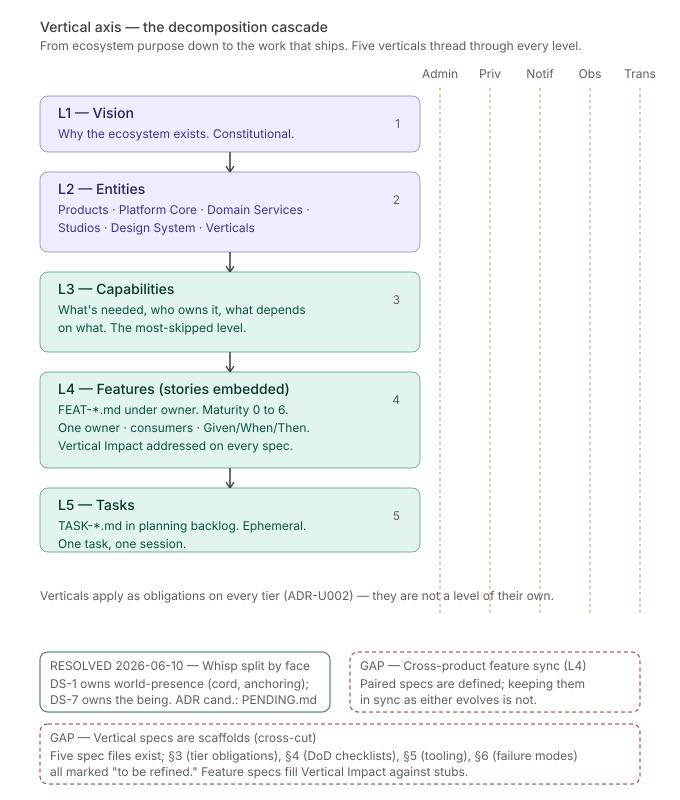

# 01 — The decomposition cascade

**The vertical axis.** How work descends from ecosystem purpose down to the tasks that ship code. Five levels, five verticals threading through every level, three unresolved gaps.

---

## What this shows

Work in FringeIsland lives in a five-level hierarchy. The same idea moves down the levels as it matures — vision-level questions become entities, entities become capabilities, capabilities become features, features become tasks. Each level answers a different question at a different frequency.

| Level | Name | Question | Primary file |
|-------|------|----------|--------------|
| L1 | Vision | Why does this ecosystem exist? | `docs/ecosystem/VISION.md` |
| L2 | Entities | What are we building and for whom? | `docs/{products,platform,studios,design-system,verticals}/` |
| L3 | Capabilities | What capabilities are needed, who owns them, what depends on what? | `.claude/skills/ecosystem-decomposition/SKILL.md` §3 + capability maps per wave |
| L4 | Features | How is each capability specified? | `docs/{owner}/features/FEAT-*.md` |
| L5 | Tasks | What implementation work is needed? | `docs/planning/backlog/tasks/TASK-*.md` |

A single feature spec file (`FEAT-*.md`) carries the feature from maturity 0-raw all the way to 6-done. The state is tracked in YAML frontmatter, not by which folder the file lives in. Tasks (`TASK-*.md`) are ephemeral — they exist only while work is in motion and are deleted after the cycle retrospective is committed.

## The five verticals thread through every level

Running vertically through the diagram are five amber dashed columns — **Administration · Privacy/GDPR · Notifications · Observability · Transactions**. These are not a sixth level; they are obligations that cut through every level.

The verticals exist because vision-level principles demand them. "Privacy over commercial opportunity" is a founding principle (VISION.md §"Non-negotiable principles") — Privacy as a vertical is how that principle becomes operational at every tier below. The same pattern applies to the other four. They are locked at five by ADR-U002; a sixth vertical would require an ADR that either splits an existing one or absorbs something currently handled elsewhere.

Every feature spec template (`docs/templates/feature-spec.md`) mandates a **Vertical Impact section** addressing all five verticals. No blanks. If a feature doesn't touch a given vertical, the spec says "None" with rationale — the vertical still gets addressed, just negatively.

## Level-by-level

### L1 — Vision

The constitutional document. Changes rarely and only through deliberate locked decisions. One page. The current VISION.md is precisely this: short, principled, orienting. It names the three founding questions (*Who am I? What do I want? How do I get there?*), the Three Worlds cosmology, the Whisp, the non-negotiable principles, and the ecosystem's intentional boundaries (what FringeIsland is *not*).

Supporting documents at this level include [`MANIFESTO.md`](../MANIFESTO.md) (the cultural companion), [`universe/`](../universe/) (creative depth on each world), and [`thinking/OPEN_QUESTIONS.md`](../thinking/OPEN_QUESTIONS.md) (the parking lot for questions whose ownership isn't yet clear).

### L2 — Entities

The ecosystem is made of products, platform services, studios, a design system, and verticals. Each is an entity with its own directory under `docs/`.

- **Products** (surfaces FIMs touch): The Hub, The Gimbal, The Game
- **Platform Core** (domain-agnostic foundation): Infrastructure, Identity, Organisation, Governance
- **Domain Services** (FringeIsland-specific): World Model, Narrative, Journeys, Content, Communication, Discovery, Intelligence, Extension System
- **Studios** (full lifecycle environments for Dreamineers): Journey Studio, Universe Studio, Arc Studio
- **Design System** — shared visual language
- **Verticals** — the five cross-cutting obligations

Each active entity has a `DESCRIPTION.md` (what and why, outward-facing) and, as it enters active development, a `SPECIFICATION.md` (how it works, inward-facing) and a `ROADMAP.md`. The split is governed by the `ecosystem-decomposition` skill §2. Note that `SPECIFICATION.md` holds sections authored by different levels under different authority — L2 owns identity/boundaries/technical shape, L3 owns the capability inventory, L4 owns the feature-inventory summary. See the skill's "Ownership of SPECIFICATION.md is shared across levels" section for the full partition.

**Verticals are the exception to this file shape.** Verticals are L2 entities — listed alongside products, services, studios, and design system — but their content profile is different. A vertical does not own capabilities of its own; it levies obligations on other entities' capabilities. It has no outward-facing narrative that warrants a separate `DESCRIPTION.md`; the constitutional purpose and scope fit compactly alongside the obligation inventory. Accordingly, a vertical uses a single `SPECIFICATION.md` that folds L2 content (purpose, scope, tooling, failure modes) and L3 content (an **Obligation inventory** in place of the capability inventory) into one file. The three-level authorship split still applies — it just lives inside one document rather than being spread across `DESCRIPTION.md` + `SPECIFICATION.md`. The `docs/templates/vertical-spec.md` template encodes this shape.

### L3 — Capabilities

The most-skipped level and the one whose absence causes the most pain. L3 is the authoritative derivation of what an entity should do — its capability space, internal ownership, internal and external dependencies, and vertical impact. It runs **per entity** (or per set of entities when the work is legitimately cross-entity) and produces the entity's capability inventory, which lives in the capability-inventory section of the entity's `SPECIFICATION.md`.

L3 derives the inventory fresh from L1 (Vision) and L2 (entity definition). It does not read existing feature specs or code during derivation — those would contaminate the authority flow. Any comparison between the authoritative inventory and existing artifacts is a separate activity called **reconciliation**, downstream of L3.

The discipline matters at any scale, but becomes load-bearing as contributor count grows: without a clean capability inventory, cross-entity dependencies become implicit, features get written without knowing what prerequisites exist, and boundaries between sibling entities drift. L3 is what lets the other levels trust the ecosystem they inherit.

See the `ecosystem-decomposition` skill §"Level 3 — Capabilities" for the full mechanics, and the skill's "Reconciliation is a separate activity" section for the relationship between L3 and downstream comparison against existing artifacts.

### L4 — Features (with stories embedded)

A feature is a specification that carries itself from idea to shipped code. Model A (locked 2026-04-17) is that the single `FEAT-*.md` file IS the artifact — there are no separate PRDs, no separate user-story files. The maturity level in YAML frontmatter tells you where the feature is.

Every feature spec lives under its owner: `docs/{owner}/features/FEAT-{PREFIX}{NNN}-{slug}.md`. Feature ID prefixes are: PC (Platform Core), PD (Platform Domain), H (Hub), G (Gimbal), GM (Game), JS (Journey Studio), US (Universe Studio), AS (Arc Studio), DS (Design System), V (Verticals).

Stories with Given/When/Then acceptance criteria are embedded inside the feature spec. These same Given/When/Then scenarios later drive test writing at three layers (see chapter 4).

### L5 — Tasks

Tasks are created only for features at maturity 4-ready or higher. One task = one focused agent session. If more than a day, split it. Tasks reference their parent feature in YAML frontmatter (`feature: FEAT-{id}`). They live in `docs/planning/backlog/tasks/TASK-*.md` and are deleted after the cycle retrospective is committed — the retrospective is the permanent learning artifact.

## Gaps flagged on this axis

Two gaps are marked on the diagram. Each is discussed in detail in [`gaps.md`](./gaps.md); the short version is here. *(A third — Whisp placement at L2, formerly G-01 — was resolved 2026-06-10 at the DS-1 descent: ownership splits by face, DS-1 World Model owning the Whisp's world-presence (cord, Void distance, anchoring, severance) and DS-7 Intelligence owning the being (dialogue, filling, internalisation); see `docs/architecture/decisions/PENDING.md` and `docs/platform/domain/world-model.md`.)*

**Cross-product feature sync (L4).** The `ecosystem-decomposition` skill says paired specs are created and linked for cross-cutting capabilities (Hub UI + Platform data model). What it doesn't say is how the paired specs stay synchronized as either evolves. There's no mechanism for catching the drift when FEAT-H005 changes its acceptance criteria and FEAT-PD003 should change with it.

**Vertical specs are scaffolds (cross-cut).** This is the most quietly compounding gap in the whole system. The five vertical spec files exist. Their §1 (Purpose) and §2 (Scope) are written. But §3 (tier-specific obligations), §4 (cross-cutting checklists that feed DoD), §5 (tooling), and §6 (failure modes) are all marked "currently partial — to be refined as the tooling matures." Meanwhile, every feature spec is forced to fill a Vertical Impact section against those stubs. Authors necessarily invent implicit definitions of what "Privacy impact" or "Observability impact" means; those implicit definitions diverge across specs; and when the vertical specs are eventually populated, a subset of shipped features will be out of compliance with the newly-explicit rules.

## Why this axis matters

The decomposition cascade is the architecture of the development process, not just of the code. The documentation hierarchy IS the product architecture — folder structure, README cascades, and YAML frontmatter function as the API for the entire development process. Getting this axis right is the difference between a solo developer's convenience tree and an ecosystem that fifty contributors can navigate without getting lost.

Every ambiguity at this level propagates downward. A fuzzy L2 ownership produces ambiguous L4 spec homes. A skipped L3 capability map produces L4 specs without dependencies named. An unpopulated vertical spec at the cross-cut produces L4 specs with quiet assumptions. The cascade is most valuable when it's load-bearing — when levels above genuinely constrain levels below.

## Canonical sources

- [`docs/ecosystem/VISION.md`](../VISION.md) — L1
- [`docs/ecosystem/strategy/PRODUCTS_AND_PLATFORM.md`](../strategy/PRODUCTS_AND_PLATFORM.md) — L2 overview
- [`.claude/skills/ecosystem-decomposition/SKILL.md`](../../../.claude/skills/ecosystem-decomposition/SKILL.md) — authoritative method for all levels
- [`docs/planning/PROCESS.md`](../../planning/PROCESS.md) §1 — maturity pipeline mechanics
- [`docs/templates/feature-spec.md`](../../templates/feature-spec.md) — L4 template
- [`docs/templates/task.md`](../../templates/task.md) — L5 template
- [`docs/verticals/CLAUDE.md`](../../verticals/CLAUDE.md) — verticals meta-guide
- [`docs/architecture/decisions/`](../../architecture/decisions/) — especially U002 (verticals), U023 (architecture)

---

*Continue to [chapter 02 — Cadence and waves](./02-cadence-and-waves.md), or return to [README](./README.md).*
