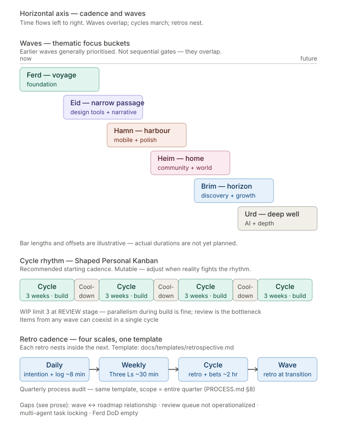

# 02 — Cadence and waves

**The horizontal axis.** How time is structured at FringeIsland. Six waves as overlapping thematic focus buckets, cycles and cooldowns as the operational rhythm, four nested retrospective scales.

---

## What this shows

Three bands, each operating at a different frequency.

**The waves band (top)** shows strategic focus over time — what the ecosystem prioritises in a given period. Six waves, named in Old Norse after the staircase of a voyage: **Ferd** (voyage, foundation) → **Eid** (narrow passage, design tools + narrative) → **Hamn** (harbour, mobile + polish) → **Heim** (home, community + world) → **Brim** (horizon, discovery + growth) → **Urd** (deep well, AI + depth).

**The cycle band (middle)** shows the operational rhythm — 3-week build cycles with 1-week cooldowns between them. This is the actual temporal structure of solo-operator work.

**The retro band (bottom)** shows the reflective cadence that threads through everything — daily intention and log, weekly Three Ls retrospective, cycle boundary retrospective and betting table, wave transition retrospective. Each retro scale nests inside the next; the same template (`docs/templates/retrospective.md`) is repurposed at every scale.

## Waves are thematic focus, not sequential gates

This is the single most counter-intuitive point about the wave model and the one most easily misread. Waves are **not** phases that complete before the next begins. Waves are **thematic focus buckets that overlap in time**. The bars in the diagram overlap deliberately — Eid work ramps up while Ferd is still winding down; Hamn work can begin before Eid is "done."

This is locked by ADR-U022 (wave names) and ADR-U024 (wave semantics). The wave-planning skill is explicit: "Work from any wave can be in any maturity state at any time. Earlier waves are generally prioritised, but this is guidance, not a rule."

Wave tags on feature specs (`wave: ferd` / `wave: eid` / etc.) are used for filtering, prioritisation, and strategic overview. They are **not** permission gates. A feature tagged `wave: hamn` can be worked on during Ferd if the capacity exists and no higher-priority Ferd item is blocked on it.

## The cycle rhythm — Shaped Personal Kanban

The cadence is a hybrid: Personal Kanban's continuous flow for daily execution, plus Shape Up's strategic shaping at cycle boundaries. The shape:

- **3-week build cycles with 1-week cooldowns between them.** Cooldown is not downtime — it's where bug fixing, tech debt, process refinement, and shaping of next cycle's bets happen. Without cooldown, every cycle's overflow becomes the next cycle's starting debt.
- **WIP limit of 3 at the REVIEW stage** — not at the doing stage. Parallelism during build is fine; review is the real bottleneck. This comes from the research report "AI Agents Broke the Sprint" that informed PROCESS.md, and is reflected directly in PROCESS.md §3.
- **Daily practice (~8 minutes total)** — morning intention (what's the one thing to ship today?), end-of-day log (what was done, what was learned, what's blocked).
- **Weekly Three Ls retro (~30 minutes, Friday)** — Liked / Learned / Lacked. Not optional even in quiet weeks.
- **Cycle boundary (~2 hours)** — retrospective for the cycle ending; betting table for the cycle starting; doc-health-check invocation; metrics review.
- **Cycle boundary tech-debt allocation** — at least one bet per cycle should be a tech-debt, NFR, or process item unless the backlog genuinely contains none. 15-20% of each cycle's capacity is the target.

The cadence is explicitly **mutable**. PROCESS.md §3 says: "The cadence below is a recommended starting point, not law. Run a few cycles, see what fights you, and adjust." The shape (cycles + cooldown + WIP limit + daily/weekly/cycle reflection) matters more than the specific durations.

## Retros nest like Russian dolls

The same retrospective template (`docs/templates/retrospective.md`) is used at four scales:

- **Daily** — a journal-style entry, ~8 min end-of-day
- **Weekly** — Three Ls retro, ~30 min Friday
- **Cycle** — full retro at cycle close, ~2 hr, feeds the next cycle's betting table
- **Wave** — full retro at wave transition, scope = entire wave, feeds the ecosystem roadmap update
- **Quarterly process audit** — same template, scope = entire quarter (PROCESS.md §8)

Nesting means daily learning feeds weekly reflection feeds cycle shaping feeds wave strategy. A retro that doesn't produce a concrete, actionable improvement for the next scale is just journaling.

## Items from any wave can coexist in a single cycle

Because waves are thematic and cycles are operational, a single cycle can legitimately pull a Ferd item, an Eid item, and a Hamn tech-debt item. What prevents overcommitment is not wave boundaries — it's the WIP limit at the review stage. That's why the WIP placement matters: putting WIP at "doing" throttles parallelism unnecessarily; putting WIP at "review" enforces the actual human-bandwidth constraint (review capacity).

## Gaps flagged on this axis

Four gaps, consolidated in [`gaps.md`](./gaps.md):

**Wave ↔ roadmap relationship.** PROCESS.md §3 references ecosystem, product, and platform roadmaps alongside the wave model. The relationship is unresolved: do waves duplicate roadmaps, complement them, or replace them? If `ECOSYSTEM_ROADMAP.md` lists "NOW: Ferd / NEXT: Eid / LATER: Hamn," it duplicates the waves band; if it lists features in NOW/NEXT/LATER buckets independent of wave grouping, it's a third band on this axis that the current diagram doesn't show.

**Review queue not operationalized.** Tasks have `status: review` and `assigned_to` in frontmatter, but no document describes how a reviewer is chosen, how a task flows from in_progress to review to approved, or how the WIP-at-review rule actually bites. The bottleneck exists on paper; it has no handle.

**Multi-agent task locking.** WIP is a personal-kanban construct. At 50+ parallel contributors, two agents can independently pick up the same `TASK-*.md`. The `assigned_to` field is the obvious lock primitive, but no atomicity rule or collision-detection mechanism is documented.

**Ferd DoD empty.** The wave-spec template has the Definition of Done shape (feature completeness, quality gates, documentation, retrospective). `docs/planning/waves/ferd.md` has not had these boxes filled with Ferd-specific criteria. This matters because "are we done with Ferd?" cannot be answered concretely without a Ferd-specific DoD — which is exactly the question the wave-planning skill is meant to answer.

## Canonical sources

- [`docs/planning/PROCESS.md`](../../planning/PROCESS.md) §3 and §8 — cadence and process audit
- [`docs/templates/cycle-plan.md`](../../templates/cycle-plan.md) — cycle plan shape
- [`docs/templates/wave-spec.md`](../../templates/wave-spec.md) — wave spec shape
- [`docs/templates/retrospective.md`](../../templates/retrospective.md) — one template, four scales
- [`.claude/skills/wave-planning/SKILL.md`](../../../.claude/skills/wave-planning/SKILL.md) — wave planning mechanics
- [`docs/architecture/decisions/`](../../architecture/decisions/) — ADR-U022 (wave names), ADR-U024 (wave semantics)
- [`docs/planning/waves/`](../../planning/waves/) — wave files + capability maps

---

*Continue to [chapter 03 — Execution: backlog and kanban](./03-execution-kanban.md), or return to [README](./README.md).*
