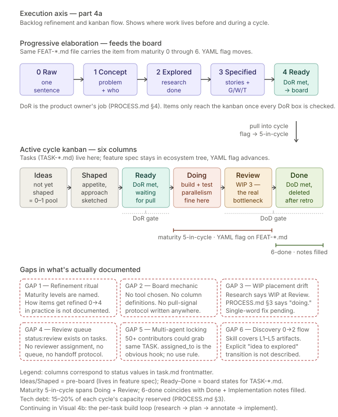

# 03 — Execution: backlog refinement and the kanban board

**Part 1 of the execution axis.** How items flow from raw ideas through progressive refinement into an active cycle board. Before you can build something, it has to be ready to build.

---

## What this shows

Two stages of the execution axis, stacked vertically.

**Top: progressive elaboration (maturity 0 → 4).** The refinement pipeline — same `FEAT-*.md` file, carrying the item from maturity 0 (raw idea) to maturity 4 (ready to pull into a cycle). The file's YAML `maturity:` frontmatter changes; the file path does not. Parking is also a YAML flag (`parked: true` + `parked_reason: {explanation}`), not a separate icebox file.

**Bottom: the active cycle kanban (maturity 5 → 6).** Six columns — **Ideas → Shaped → Ready → Doing → Review → Done**. When an item at 4-ready is pulled into a cycle, the YAML flag advances to **5-in-cycle** and TASK files are generated. The spec reaches **6-done** when every task has passed DoD and Implementation notes are filled in. Each task (`TASK-*.md`) carries its own `status:` in YAML frontmatter matching the column.

## The maturity pipeline is a real gate, not a label

An item enters at maturity 0 and progresses through the levels as genuine work is done. The discipline is **never skip a level**.

### Refinement pipeline (0 → 4) — the diagram's top row

- **0 Raw** — one sentence, "wouldn't it be cool if..."
- **1 Concept** — problem identified, who benefits, rough shape
- **2 Explored** — research done, approach sketched, risks named
- **3 Specified** — stories written with Given/When/Then acceptance criteria
- **4 Ready** — all questions answered, DoR met, estimable

Levels 0–4 are owned by the product owner. The artifact at each level is the feature spec itself (`FEAT-*.md`), progressively filled in.

### On-board pipeline (5 → 6) — what happens once the item is pulled into a cycle

- **5 In cycle** — the feature spec's YAML `maturity:` flag moves from `4-ready` to `5-in-cycle` when a cycle pulls the item. `TASK-*.md` files are generated under `docs/planning/backlog/tasks/` at this point. The feature spec stays put in the ecosystem tree; the task files are the ephemeral on-board representation. Maturity 5 **spans both the Doing and Review kanban columns** — a task can be in Review while its parent feature is still at 5-in-cycle.
- **6 Done** — when the last task on the feature hits DoD and is approved through review, the developer flips the spec's YAML to `6-done` and populates the **Implementation notes** section: what was actually built, where it lives, key files, migrations, RPCs, components, decisions made during implementation. Forward-looking sections on the spec (Solution sketch, Appetite, Rabbit holes) become obsolete once the feature is 6-done. The spec has reshaped itself from *proposal* into *record*. The task files are deleted after the cycle retrospective is committed.

Levels 5–6 are owned by the developer (the AI agent, when delegated).

### Maturity and kanban columns are orthogonal

These are two different tracking mechanisms operating on two different objects:

- **Maturity** is a YAML flag on the *feature spec*. One feature = one flag.
- **Kanban column** is the `status:` field on a *task file*. One feature can have multiple tasks, each in a different column.

A feature reaches maturity 5-in-cycle the moment any of its tasks enters Doing. It only reaches 6-done when all of its tasks reach the Done column and the Implementation notes are written. If a feature has three tasks and two are Done while one is still in Review, the feature is at 5-in-cycle, not 6-done.

### Why the pipeline matters

The pipeline exists because of a lesson learned: Ferd's early roadmap was built before proper research, leading to architectural assumptions that weren't validated and scope decisions made without sufficient investigation. The pipeline enforces "research before specification" — an item cannot reach maturity 3 without having passed through maturity 2. Skipping ahead is how bad assumptions get baked in.

Under Model A (locked 2026-04-17), the same file carries the item from 0 through 6. There are no separate PRDs, no separate user-story files, no backlog/discovery.md/product.md/icebox.md files. One file, one YAML field, one trajectory.

## The Definition of Ready is the gate into the board

An item does not get pulled onto the kanban just because someone wants to build it. It must first pass DoR — the Definition of Ready, defined in PROCESS.md §4. Every box must check.

DoR is the product owner's job (Stefan's), not the developer's. Its purpose is to protect the developer (and the AI agent) from vague work. If an item fails DoR, it doesn't go on the board — it goes back to the maturity pipeline for more elaboration.

Full DoR checklist (from PROCESS.md §4):
- User story format ("As a [role], I want [capability], so that [benefit]")
- Value is clear (one sentence answering "why does this matter?")
- Acceptance criteria defined with Given/When/Then scenarios
- Item is independent (no unresolved blockers)
- Item is small enough (1–3 days of focused work; larger items split)
- UI/UX approach sketched for user-facing items
- Data model implications understood
- Edge cases identified
- Cross-product dependencies identified
- No unresolved open questions

## Kanban column semantics

The six columns correspond to values of the task `status:` field (except Ideas and Shaped, which are pre-board states living in feature specs at maturity 0–1 and 2 respectively).

- **Ideas** — pre-board. Features at maturity 0-raw or 1-concept. Exist as `FEAT-*.md` under their owner; no task file yet.
- **Shaped** — pre-board. Features at maturity 2-explored. Have appetite set and a rough approach sketched; still not ready to build.
- **Ready** — on the board. Features at maturity 3-specified and 4-ready. Tasks generated. Passed DoR. Waiting to be pulled into the active cycle.
- **Doing** — on the board. Tasks in motion (`status: in_progress`). Parent feature is at maturity 5-in-cycle. Parallelism here is fine — WIP is enforced downstream.
- **Review** — on the board. Tasks awaiting review (`status: review`). Parent feature still at maturity 5-in-cycle. **This is where WIP limit 3 applies** — review capacity is the real bottleneck.
- **Done** — on the board. Tasks that have passed DoD (`status: done`). When all of a feature's tasks are Done and Implementation notes are filled in, the parent feature flips to 6-done. The task files survive the cooldown and are deleted after the cycle retrospective is committed.

## Definition of Done is the gate out

DoD (PROCESS.md §5) is the developer's job (the AI agent's job, when delegated). It is universal across all work, unlike acceptance criteria which are story-specific. Every applicable box must check.

Full DoD checklist:
- All acceptance criteria implemented and verified
- ESLint + TypeScript strict pass with no new warnings
- Key logic unit-tested
- Mobile responsive (for any UI change)
- Supabase RLS policies applied (every new table, every new access pattern)
- Builds without errors locally and in CI
- Deployed to preview environment and verified
- README and/or CHANGELOG updated if user-visible behavior changed
- Platform Specification updated if a shared API surface changed
- Complex decisions documented as ADR

DoD is applied per task. The feature-level transition to 6-done happens when *all* of a feature's tasks have individually cleared DoD AND the Implementation notes section on the spec has been populated. Those two are sibling gates: a task can be at `status: done` while the parent feature is still at 5-in-cycle because Implementation notes haven't been written yet, or because other tasks on the same feature remain open.

## Tech debt allocation

PROCESS.md §3 names 15-20% of each cycle's capacity for tech debt. This is not a floor; it's a target that prevents feature work from consistently crowding out quality work. Tech debt items live in the same backlog as features, tagged `type:tech-debt`, using a lightweight version of the feature-spec template.

## Gaps flagged on this axis

Six gaps, consolidated in [`gaps.md`](./gaps.md):

**GAP 1 — Refinement ritual undocumented.** The maturity levels are named, but how items actually get refined from 0→4 in practice is not documented. Is it a meeting? A solo shaping session? A back-and-forth with Claude that produces patches to the feature spec? The canonical skill describes the *artifacts* at each level but not the *activity* that produces them.

**GAP 2 — Board mechanic unchosen.** The diagram depicts six columns; no document says where that board physically lives. GitHub Projects? Linear? A markdown table? A query over YAML frontmatter? PROCESS.md §3 names the WIP limit without specifying the artifact that enforces it. For 50+ contributors this is load-bearing.

**GAP 3 — WIP placement drift.** Research intent: WIP at review stage. PROCESS.md §3 current text: "WIP limit: 3 items in doing at any time." One-word fix pending.

**GAP 4 — Review queue not operationalized.** `status: review` exists on tasks. No reviewer assignment protocol, no review queue mechanic, no handoff rules, no review-failed-back-to-doing path is described.

**GAP 5 — Multi-agent task locking.** At 50+ contributors, two agents can independently pick up the same `TASK-*.md`. The `assigned_to` field is the obvious lock primitive; no atomicity rule, first-to-claim-wins mechanic, or collision detection is specified.

**GAP 6 — Discovery workflow 0→2 orphaned.** The `ecosystem-decomposition` skill covers levels 1–5 as artifacts. The explicit transition from "raw idea I noticed this morning" to "problem-identified concept" has no home — it's not covered by a skill, not described by PROCESS.md, and not in any template beyond the maturity labels themselves.

## Canonical sources

- [`docs/planning/PROCESS.md`](../../planning/PROCESS.md) §1, §4, §5 — maturity pipeline (full 0–6 table), DoR, DoD
- [`docs/planning/backlog/tasks/README.md`](../../planning/backlog/tasks/README.md) — task lifecycle
- [`docs/planning/cycles/README.md`](../../planning/cycles/README.md) — cycle mechanics
- [`docs/templates/task.md`](../../templates/task.md) — task file shape
- [`docs/templates/feature-spec.md`](../../templates/feature-spec.md) — feature spec shape, including Implementation notes section
- [`docs/templates/cycle-plan.md`](../../templates/cycle-plan.md) — cycle plan shape
- [`.claude/skills/feature-development/SKILL.md`](../../../.claude/skills/feature-development/SKILL.md) — task creation step
- [`docs/research/The solo developer's complete guide to systematic web development.md`](../../research/The%20solo%20developer%27s%20complete%20guide%20to%20systematic%20web%20development.md) — the research that shaped the pipeline

---

*Continue to [chapter 04 — Execution: the build loop](./04-execution-build-loop.md), or return to [README](./README.md).*
