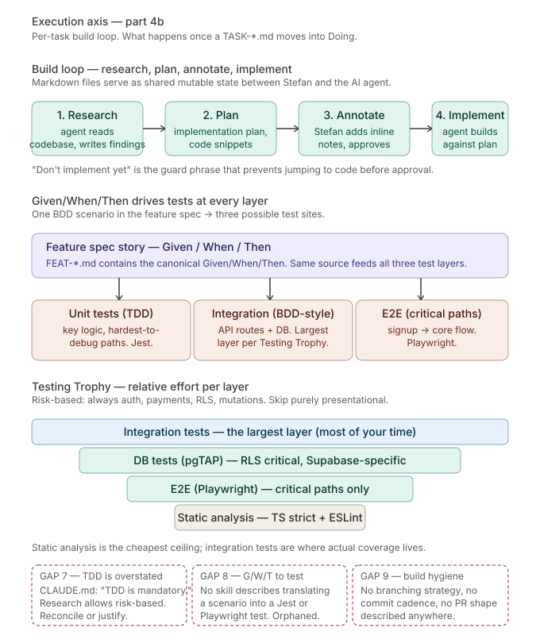

# 04 — Execution: the per-task build loop

**Part 2 of the execution axis.** What happens once a task moves from Ready into Doing. The build loop, the BDD-to-test translation, the testing trophy shape.

---

## What this shows

Three stacked sections.

**Top: the build loop** — Research → Plan → Annotate → Implement. The canonical pattern for working with an AI coding agent. Markdown files serve as shared mutable state between Stefan and the agent.

**Middle: Given/When/Then feeds three test layers.** The same BDD scenario from the feature spec becomes the input to unit tests (TDD-style), integration tests (BDD-style), and E2E tests (critical paths). One source, three layers.

**Bottom: the Testing Trophy.** Relative effort per layer. Integration is the biggest band. Static analysis is the free foundation. E2E and database tests are smaller but critical — database tests especially matter in a Supabase-RLS-heavy stack.

## The build loop: Research → Plan → Annotate → Implement

This is the core working pattern with Claude Code and any similar AI coding agent. It comes from the research report "The Solo Developer's Complete Guide to Systematic Web Development" under `docs/research/`. The report frames it as "the most effective pattern for Claude Code."

1. **Research.** The agent reads relevant code and writes findings to a research document (typically `docs/research/research-{feature}.md`). "What does the current auth flow look like? What tables are involved? What helpers exist?"
2. **Plan.** The agent produces a detailed implementation plan with code snippets in a plan document (typically `docs/research/plan-{feature}.md`). Concrete enough to be actionable; structured enough to review.
3. **Annotate.** Stefan reviews the plan, adds inline notes in his editor, then instructs the agent: *"I added notes, address them and update the plan. Don't implement yet."* The guard phrase is critical.
4. **Implement.** Once the plan is solid, Stefan instructs: *"Implement it all. Mark tasks as completed in the plan document."*

The markdown file is the interface. It is read and written by both Stefan and the agent. It carries the state of the work across turns. This is the concrete mechanism that makes "documentation IS the primary artifact, code is the byproduct" operational at the task level — not an aspirational slogan.

## Given/When/Then is one source, three test sites

The feature spec template (`docs/templates/feature-spec.md`) requires each story to have Given/When/Then acceptance criteria inline. Those same scenarios are then the canonical source for test writing at three layers:

- **Unit tests (TDD-style, Jest).** Test the hardest-to-debug internal logic. Writen either test-first (TDD) or after-the-fact (risk-based), depending on the situation.
- **Integration tests (BDD-style, Jest + Supabase).** API routes with their real database, components with their real dependencies. This is the **largest layer** per the Testing Trophy.
- **E2E tests (Playwright).** Critical user paths only — signup → onboarding → core feature flow.

One Given/When/Then translates differently at each layer. The spec's "*Given I am logged in, when I submit the form, then the record is saved*" becomes:
- Unit test: validates the form-submission handler function with mocked dependencies
- Integration test: validates the POST endpoint with a real database and real auth
- E2E test: validates the full browser-driven submission through the actual UI

The value of keeping the source canonical in the feature spec is that the same scenario can be referenced from any of the three test files — and when the scenario changes (edge case discovered, requirement refined), all three test layers know where to look.

## The Testing Trophy shape

Kent C. Dodds's Testing Trophy replaces the classic testing pyramid. For the FringeIsland stack:

1. **Static analysis** — TypeScript strict mode + ESLint. Free. Catches the largest class of bugs with zero test-writing effort.
2. **Integration tests** — the largest layer. Most of the testing time goes here. "Write tests. Not too many. Mostly integration."
3. **Database tests (pgTAP)** — Supabase-specific, RLS-critical. Tested with `npx supabase test db`. Every new RLS policy has a pgTAP test.
4. **E2E tests** — smallest slice but catches what integration can't. Signup → core feature flow. Run last in CI.

The shape is "risk-based testing": always test auth, payments, RLS policies, and data mutations. Integration-test API routes and critical flows. E2E-test the signup-to-core-feature path. Skip testing purely presentational components and prototype features.

Note a deliberate constraint: Vitest cannot test async Server Components in Next.js. Use Playwright for those; use Jest for synchronous components and pure logic.

## TDD vs risk-based testing — a note on the tension

The root `CLAUDE.md` currently says "TDD is mandatory." The research report that informed the rest of PROCESS.md is more nuanced: it says write BDD acceptance criteria in stories, and "let those guide your test-writing — whether you write tests first (TDD) or after implementation (risk-based testing)."

This is a real decision point, not just wording. Strict TDD (red-green-refactor, tests first, always) has different costs and benefits than risk-based testing. Both are valid. This gap is flagged on the diagram and discussed in [`gaps.md`](./gaps.md). The right move is to decide explicitly — either drop the strict TDD mandate to match the research, or keep it and justify the stricter position in an ADR.

## Gaps flagged on this axis

Three gaps, consolidated in [`gaps.md`](./gaps.md):

**GAP 7 — TDD is overstated.** `CLAUDE.md` issues a hard TDD mandate. The research report permits risk-based testing as an alternative. The stricter version was inherited without an explicit decision. Reconcile or justify.

**GAP 8 — Given/When/Then to test translation.** The feature-spec template has Given/When/Then scenarios. Jest, Playwright, and pgTAP exist in the stack. No skill or document describes how scenario 1 in FEAT-H001 becomes test case 1 in `tests/integration/auth.test.ts`. The single highest-leverage practice from the research (one artifact serving as spec, tests, *and* AI prompt) has no documented translation mechanic.

**GAP 9 — Build hygiene unspecified.** No branching strategy documented. No commit cadence beyond "conventional commits". No PR shape described. No guidance on when to open a PR, how to structure it, who reviews, how review feedback flows back. For 50+ contributors the absence is load-bearing.

## The pattern: strong bookends, weak middle

Looking at chapters 3 and 4 together, the FringeIsland development system has:

- **A strong top** — vision, entities, capabilities, feature specs are thoroughly described.
- **A strong bottom** — DoD is explicit and well-structured.
- **A weak middle** — how items move through maturity is named but not described; the build loop is not in any skill; the Given/When/Then → test translation has no home.

This matches a pattern visible across the whole ecosystem: heavy investment in the strategic layer (PROCESS.md, skills, templates, ADRs) and light investment in the tactical layer (how work actually gets done). Acceptable while Stefan is the only operator and tacit knowledge fills the gap. Blocking at the 50-contributor scale the architecture is designed for.

The highest-leverage improvement available is probably **expanding the `feature-development` skill** to cover the build loop explicitly, the Given/When/Then → test translation, and the branching/commit hygiene. Not a new skill — the existing one, made fit for purpose.

## Canonical sources

- [`docs/planning/PROCESS.md`](../../planning/PROCESS.md) §5 — Definition of Done
- [`.claude/skills/feature-development/SKILL.md`](../../../.claude/skills/feature-development/SKILL.md) — the execution skill
- [`docs/templates/feature-spec.md`](../../templates/feature-spec.md) — Given/When/Then shape
- [`docs/research/The solo developer's complete guide to systematic web development.md`](../../research/The%20solo%20developer%27s%20complete%20guide%20to%20systematic%20web%20development.md) — research behind the build loop and the Testing Trophy
- [`/CLAUDE.md`](../../../CLAUDE.md) — TDD mandate, testing commands, critical gotchas

---

*Continue to [chapter 05 — Agent routing](./05-agent-routing.md), or return to [README](./README.md).*
