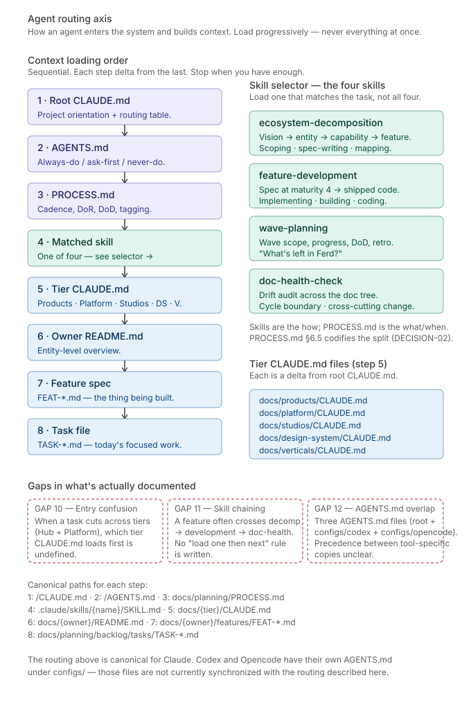

# 05 — Agent routing

**The routing axis.** How an agent (or a human) enters the FringeIsland repo and builds context progressively from project orientation down to the specific task at hand. The entry path for every contributor, every session.

---

## What this shows

Two columns.

**Left column: the eight-step context loading order.** An agent starts at root `CLAUDE.md` and descends through `AGENTS.md`, `PROCESS.md`, a matched skill, the cascade `CLAUDE.md` files, an owner `README.md`, a feature spec, and a task file. Each step is a delta on the previous — load only what you need to proceed.

**Right column: the skill selector.** At step 4, the agent chooses which of the four skills matches the task at hand. Load one — not all four. Below the selector, the tier `CLAUDE.md` files named explicitly for step 5. (The diagram still shows the original five-tier-file layout; the cascade has since grown to five levels — see "The CLAUDE.md cascade" below. Diagram refresh is deferred to the chapter sweep tracked under G-25.)

## Load progressively, never all at once

The canonical rule from root `CLAUDE.md`: *"Load progressively. Never load all features at once — pull only what the task actually needs."*

An agent that loads everything available at the start of a session spends its context budget on orientation rather than work. The eight-step order is tuned to pay for exactly as much context as the task needs, then stop. A quick task ("fix this typo in the Hub README") might stop at step 2 or 3. A feature-build task goes all the way to 8.

## The eight steps

1. **Root `CLAUDE.md`** — project orientation and routing table. *WHERE* to look, *which skill* to load. This is the entry document.
2. **`AGENTS.md`** — always-do / ask-first / never-do boundaries. *What you may and may not do.*
3. **`docs/planning/PROCESS.md`** — way of working. Cadence, DoR, DoD, tagging. *WHAT and WHEN.* Skimmed once, returned to as needed.
4. **Matched skill** — one of four under `.claude/skills/`. *HOW.* The execution layer.
5. **Cascade `CLAUDE.md` files** — the tier `CLAUDE.md` for where the work lives (Products, Platform, Studios, Design System, or Verticals), plus any sub-tier, entity, and sub-entity `CLAUDE.md` files in the cascade. Each is a *delta* from the level above; reads as "what's specific when working in this subtree."
6. **Owner `README.md`** — the entity (Hub, Platform Core, Journey Studio, specific vertical). Entity-level overview, list of specs, status.
7. **Feature spec** — `docs/{owner}/features/FEAT-*.md`. The canonical source of acceptance criteria for the thing being built.
8. **Task file** — `docs/planning/backlog/tasks/TASK-*.md`. Today's focused unit of work. At this point the build loop from chapter 4 begins.

## The skill selector

PROCESS.md says *what* and *when*. The four skills say *how*. They live under `.claude/skills/` and are loaded at step 4 based on the task type:

- **`ecosystem-decomposition`** — load when scoping, spec-writing, or mapping. Decomposing vision → product → feature → story → task. Writing or updating a DESCRIPTION, SPECIFICATION, feature spec, or capability map.
- **`feature-development`** — load when implementing, building, coding. Features at maturity 4-ready or higher. Picks up the spec, generates tasks, writes code against acceptance criteria, runs lint and tests, updates maturity to 6-done.
- **`wave-planning`** — load when asking about wave scope, progress, DoD, or retrospective. "What's left in Ferd?" "Are we done with Eid?" Cross-cuts the ecosystem because a wave references features under many different owners.
- **`doc-health-check`** — load at cycle boundaries or after cross-cutting changes (renames, deletions, schema migrations, folder restructures). Runs ten checks across the documentation tree — including cascade-integrity verification (Section 9) — to catch drift before it accumulates.

The split between PROCESS.md and skills is codified by PROCESS.md §6.5 (DECISION-02). Strategic rhythm stays in PROCESS.md (changes slowly); operational mechanics live in skills (change faster); merging them would produce a 1500-line monolith nobody reads.

## The CLAUDE.md cascade

What began as five tier files has grown into a five-level cascade: **root → tier → sub-tier → entity → sub-entity**. Each `CLAUDE.md` operates as a **delta** from the level above — root carries the project-wide rules; each deeper file adds only what's specific to its subtree. Twenty `CLAUDE.md` files exist under `docs/` as of 2026-06-10.

- **Tier** — `docs/products/CLAUDE.md` (Hub, Gimbal — products are equipment profiles with the Game as depth, ADR-U025), `docs/platform/CLAUDE.md` (Platform Core and Domain Services), `docs/studios/CLAUDE.md` (World, Arc, Journey under Universe Studio, ADR-U026), `docs/design-system/CLAUDE.md` (shared visual language), `docs/verticals/CLAUDE.md` (meta-guide for the five vertical specs).
- **Sub-tier** (platform only) — `docs/platform/core/CLAUDE.md` and `docs/platform/domain/CLAUDE.md`, distinguishing Core's stability-zone rules from Domain's iteration-zone rules (ADR-U023).
- **Entity** — e.g. `docs/products/hub/CLAUDE.md`, `docs/products/gimbal/CLAUDE.md`, `docs/studios/universe-studio/CLAUDE.md`, and the per-vertical files.
- **Sub-entity** (opt-in by divergence) — the canonical case: `world-studio/`, `arc-studio/`, `journey-studio/` under Universe Studio (ADR-U026).

Root `CLAUDE.md` carries the canonical **five-row content policy** saying what each level must, may, and must not contain. The `doc-health-check` skill verifies cascade integrity at cycle boundaries (Section 9): presence, content categorisation, load-order pointer integrity.

The delta-first discipline is locked by Session A decisions (Session A, 2026-04-17). Each tier file follows a six-section skeleton: header → What makes this tier different → Verticals: obligations on this tier → Rules that only apply at this tier → Gotchas → Where to go next. Content that duplicates root is cut. What remains is genuinely tier-specific.

The "Verticals: obligations on this tier" section in each tier `CLAUDE.md` is the link from the vertical specs (chapter 1) to the operational work of the tier. When a vertical spec's tier-specific obligations change, the corresponding bullets in the five tier `CLAUDE.md` files may need matching updates — currently a manual synchronization.

## Why this axis matters

Chapters 1 and 4 describe what exists in the ecosystem and how work moves through it. Chapter 5 describes how a new participant finds their place in it. It's the onboarding path.

The quality of this axis is what lets FringeIsland scale from solo operator to fifty contributors without central coordination. If root `CLAUDE.md` is clear, the cascade from there is self-routing. If root is unclear, every contributor reinvents the routing from scratch.

A tell for whether the axis is healthy: new contributors should be able to start useful work within 30 minutes of opening the repo. The eight-step path, followed in order, should get them there.

## Gaps flagged on this axis

Three gaps, consolidated in [`gaps.md`](./gaps.md):

**GAP 10 — Cross-tier entry confusion.** Step 5 of the load order says "the tier `CLAUDE.md` for where the work lives." When a feature legitimately spans two tiers — a Hub UI feature paired with a Platform Domain data model feature — which tier `CLAUDE.md` loads first is undefined. The two files have different tier-specific rules and different verticals obligations; loading them in the wrong order means the agent internalizes the less-relevant constraints first. This is the routing-layer equivalent of the cross-product feature sync gap from chapter 1.

**GAP 11 — Skill chaining undocumented.** Most real work crosses skills. Scoping a new Ferd feature uses `ecosystem-decomposition` to author the spec, then `feature-development` to build it. Closing a cycle uses `feature-development` to finalise maturity 6-done specs, then `doc-health-check` to verify the trail. The four skills are described as discrete tools; the real workflow chains them. No document says "after X, load Y." The chains are currently tacit.

**GAP 12 — AGENTS.md precedence across tools.** The repo has three `AGENTS.md` files: `/AGENTS.md` (canonical), `configs/codex/AGENTS.md` (Codex CLI), `configs/opencode/AGENTS.md` (Opencode). If someone contributes using Codex or Opencode, their tool-specific `AGENTS.md` could drift from the canonical one. No precedence rule is written — does root win? Most-specific? Last-loaded? For an ecosystem designed for 50+ contributors using whichever agent tool they prefer, this is a real precedence question.

## Canonical sources

- [`/CLAUDE.md`](../../../CLAUDE.md) — entry document, routing table
- [`/AGENTS.md`](../../../AGENTS.md) — always-do / ask-first / never-do
- [`docs/planning/PROCESS.md`](../../planning/PROCESS.md) — WHAT and WHEN, §6.5 for the skills-PROCESS split
- [`.claude/skills/`](../../../.claude/skills/) — the four skills
- [`docs/products/CLAUDE.md`](../../products/CLAUDE.md), [`docs/platform/CLAUDE.md`](../../platform/CLAUDE.md), [`docs/studios/CLAUDE.md`](../../studios/CLAUDE.md), [`docs/design-system/CLAUDE.md`](../../design-system/CLAUDE.md), [`docs/verticals/CLAUDE.md`](../../verticals/CLAUDE.md) — the five tier deltas, plus the sub-tier, entity, and sub-entity `CLAUDE.md` files beneath them (twenty files as of 2026-06-10)
- [`configs/codex/AGENTS.md`](../../../configs/codex/AGENTS.md), [`configs/opencode/AGENTS.md`](../../../configs/opencode/AGENTS.md) — tool-specific copies (not synchronized with root)

---

*Return to [README](./README.md), or jump to the consolidated [gaps register](./gaps.md).*
